Race Into Space Game Manual
===========================
by Leon Baradat

version 2.0

Based on
*Buzz Aldrin's Race Into Space! Rules of Play*
by Fritz Bronner

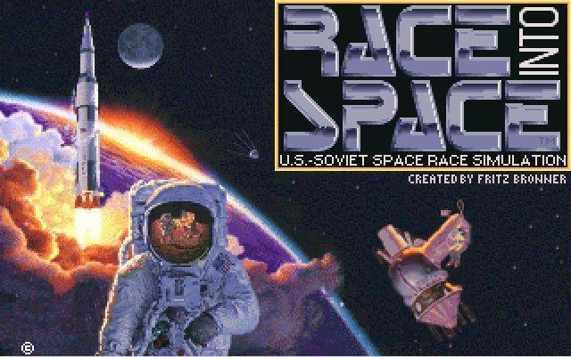

### Introduction

This is a simulation of the US-Soviet Space Race.  In it, you take charge of your country's space program as Director (US) or Designer (USSR).  You will purchase and develop space hardware, recruit and manage astronauts/cosmonauts, and plan and send missions into space.  The ultimate goal is to be the first to complete a Moon landing and return your people safely to Earth.

Race Into Space (RIS) is a port to modern operating systems of Buzz Aldrin's Race Into Space (BARIS), a DOS game originally released in 1993 on floppy disk, and a year later in an expanded CD version.  BARIS was developed by Fritz Bronner based on his 1989 board game *Liftoff!*.  Dr. Aldrin's name and imagery have been dropped because permission to use them was limited to the old DOS game.  RIS is available for Windows, Linux, and Mac, and includes some improvements over the original game—which we feel have justified a rewrite of the manual.  Those involved in RIS are volunteer enthusiasts, and we hope you enjoy this simulation.  You might even find it educational.

This is a strategy game that requires some planning ahead.  There are different paths to victory; any of these can be used, and each has its own advantages. 

* Gemini/Voskhod – a two-person capsule that requires a one-person lander.  Easiest to get started but tricky, and riskier than other approaches.  Voskhod is especially dangerous.

* Apollo/Soyuz – the historic approach.  Fairly straightforward, but it can be difficult to afford early on.

* XMS-2/Lapot – a three-person minishuttle.  Tough to get started, but reusable spacecraft are a boon later in the game.

* Jupiter/LK-700 (formerly Kvartet) – a four-person direct ascent capsule.  The simplest way to get to the Moon, but startup costs can be prohibitive.

One rule of thumb is that the latter two are so expensive to prototype and research that they're usually not practical options if your prestige is low when you're ready to choose your approach to the Moon (often, about the time you're flying Orbital missions with Mercury/Vostok), though Lapot isn't oo bad in that respect.  Conversely, if you happen to receive a newscast just then saying all hardware will be 50% off for a turn, direct ascent and the minishuttles suddenly become very feasible.

One question to consider is whether to maintain a backup strategy.  Early testers recommended the historical path, flying the one-person capsule, then the two, then moving on to the three-person spacecraft for lunar missions.  They would then keep Gemini/Voskhod as a backup program, and switch over to it if their primary suffered a catastrophic failure.  This can be a helpful strategy, though it's only practical if you are planning to go to the Moon with Apollo/Soyuz or XMS-2/Lapot.  It is also more costly than going straight from Mercury/Vostok to your final spacecraft.

The game has many keyboard commands; those that activate buttons usually have the corresponding letter displayed in a different color in the relevant button.  Pressing F2 will show the keyboard commands for that screen; also, pressing F1 will activate context-sensitive help for the screen.

Although RIS includes a number of improvements over the original BARIS, the look and feel and the gameplay should be mostly the same.  For the most part, the changes should simply make it easier to play, as the game used to have a lot of rough edges.  Also a few of the names (of rockets, capsules, and spacepeople) have been changed to improve its educational potential, as a historical simulation of the 1960s Space Race.  Information about the Soviet lunar program was limited when BARIS was developed, which required some educated guesses at names for some of the Soviet hardware and cosmonauts.  RIS has been able to take advantage of what's known today to use more historical names.  It also includes a large number of bug fixes, especially in mission failure handling, and newscasts that didn't work as they should.

Race Into Space, like BARIS, uses its own flight profile for the historically considered approaches to the Moon.  So the terms in RIS don't correspond to those used during the Space Race, but they work well in-game and their meaning is more straightforward.  You will see these terms mentioned in newscasts; just bear in mind that the newscast is referring to the historic proposal and has no bearing on your space program.

**Direct Ascent** is the same as the historic proposal: a single capsule which lands on the Moon, like in old sci-fi movies.

**Lunar-Orbital Rendezvous (LOR)** is called the Historical Manned Lunar Landing in the game.  It's what happened on the Apollo landings and what the Soviets were planning—the capsule and LM launch together on a single rocket, go to the Moon together, then rendezvous in lunar orbit when the LM leaves the lunar surface.  In the game, LOR is a Joint mission where the capsule and LM are launched on separate rockets, fly separately to the Moon, and rendezvous in lunar orbit.

**Earth-Orbital Rendezvous (EOR)** was a proposal by Wernher von Braun to use multiple smaller rockets to launch the components for a direct-ascent type capsule built in Earth orbit.  The Soyuz Lunar Landing is based on a similar concept proposed early on by the Soviets, but it was converted to a form of LOR mission for game balance.  In RIS, EOR is a Joint mission where the capsule and LM are launched on separate rockets, rendezvous in Earth orbit, and fly together to the Moon.

## Designer's Notes

by Fritz Bronner

The actual space race between the U.S. and USSR was extremely close.  All of the major space hardware, including alternative proposals, are available.  This gives you the same flexibility as your real-life counterparts had.

Some modifications obviously had to be made for simplification of monetary units and budgets.  A megabuck or MB was designed as the universal monetary standard.  This creates a quicker analysis of costs and budgets between countries.

As in the game, real life programs were man-rated after an extensive R&D phase and a flight testing program.  After several successful launches/flights a vehicle was given approval to carry humans.  Percentages were incorporated into the game as [an] aid to help the player evaluate this choice.  The dilemma of when a rocket or capsule is ready to carry humans is the player's decision.  Short cuts may be necessary as they were in real life.

Most of the major rocket boosters are available for game play.  For play balance some minor programs were deleted.  The lift capability of the various rockets were greatly simplified as a common unit weight.  The Soviets had more powerful rockets but their payloads were generally heavier, so any lift advantage was lost [ed. note: not entirely—rocketry is still one of the Soviet player's advantages].  Determining which rocket boosters are to be used for various payloads is the important factor.

Capsule design features were also simplified.  The Soviets brought the Soyuz capsule through three major design phases.  There were also many minor variants.  The Gemini capsule was more advanced than the Voskhod, which had limited maneuverability and couldn't dock.  The weight ratios of all the spacecraft were altered for game play.  Most of the basic historical design features of spacecraft are included in the game.

All events are based on historical events that occurred in some fashion.

Most of the astronauts and cosmonauts of that time period in history are included for game play.  Their skills are strictly subjective with an historical flavor for game play.  They are not meant to reflect any real life individual's strengths and weaknesses.  [Ed. note: there was some attempt, however, at highlighting certain people's extraordinary abilities, such as Aldrin in docking and Leonov in EVA.]

All of the lunar approaches were seriously considered by the U.S. and USSR and they all are included in this game.  Some steps in these and other space missions were deleted or greatly simplified.  For all of the space missions, most of the major hurdles and challenges were retained in spirit if not accuracy.

Certain animated sequences and still images were altered and models were constructed to portray mission events more dramatically and were not meant for historical interpretation.  Some American space footage was used to reflect certain Soviet sequences.

A great emphasis is given to the magnitude of this Cold War space race.  The consequences were of national importance.  The end game was included to give the player the spirit of dramatically changing history.  It was never intended for accuracy.

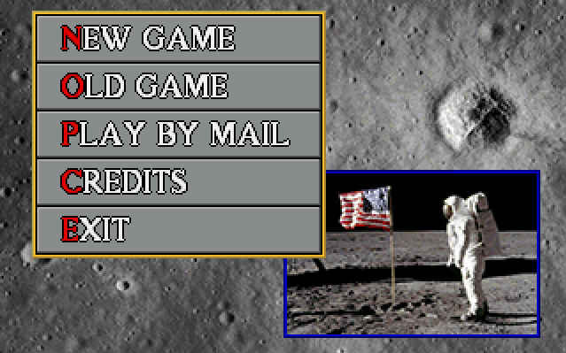

## Multiplayer

Race Into Space offers two forms of multiplayer: hotseat and play by email (PBEM).  To start a hotseat game, select New Game at the main menu and make both sides human players.  Everything else for hotseat is just like a single-player game.  Play by Mail has been disabled by default, but is mentioned here for the sake of completeness.

*To start a PBEM game, select PLAY BY MAIL; note that whoever sets up the game must play the US.  When you hit the flagpole to end your turn, you will be prompted to enter a name for the save game.  Close RIS and email the save file to your opponent.  You should find it in Documents\raceintospace (Windows) or ~/.raceintospace (Linux or Mac).  The name will show like the others, e.g. BUZZ4.SAV, but you can find it by looking for the most recent save.  Your opponent saves the file to that location on their computer, opens the game and loads the save (it should show in yellow in the Time Capsule).  They play their turn and will be prompted automatically to name the game, as you were.  Then they email the save back to you and the cycle repeats.*

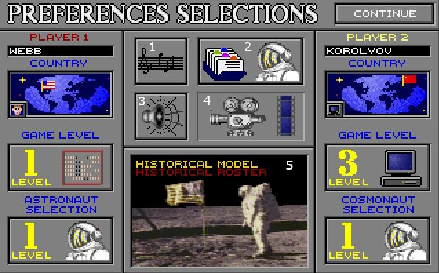

## Lift Off!

This is the Preferences screen.  On either side you can set the basic preferences for that side.

* Player Name: maximum 12 characters long.
* Country: the US on the left, USSR on the right.
* Game Level: game difficulty level for that side (missions receive more penalties at levels 2 & 3).
* Astronaut/Cosmonaut Selection: difficulty level for that side in managing spacepeople.</td>

In the center are some preferences that affect both sides:

1. Music: on or off
2. Astronaut Roster: edit the custom roster (disabled)
3. Sound: on or off
4. Animation: movies or still photos while playing your missions (disabled)
5. Model and Roster Type: Historical or Basic model, Historical or Custom roster

Select the country(ies) you wish to play and the features you desire.  The game defaults to single player with the human as the US.  Selecting a side to be played by a human defaults it to Game Level 1, and selecting a side to be played by computer defaults it to Level 3.  You can change these values to suit you, of course.  Setting both sides to humans creates a two-player Hotseat game.

~~If you selected PLAY BY MAIL in the main menu, that will show at the top in place of PREFERENCES, and both sides will be set to human.~~

**Game Level**

There are 3 levels of difficulty: level 1 is easiest for that side, and 3 the hardest.  Setting your opponent at a higher level handicaps them, which is why the game defaults computer opponents to level 3.  One thing to be aware of is that in a single-player game a human playing at level 2 or 3 can be fired if they do poorly enough.

**Astronaut/Cosmonaut Selection**

There are 3 levels of difficulty.  Most of the difference is that at lower levels you see more information about your people. 

**2 Astronaut Roster**

This is disabled in the current version of RIS.

~~This lets you edit the custom roster; it can be changed at the start of every new game.  You can change names and/or skills; however, you can't exceed your total number of skill points—in order to add points to one skill, you must subtract some from another.  Note that you can only save one custom roster.~~

**4 Animation**

This is disabled in the current version of RIS.

~~You can have the game show still images in place of movies, if you want to.~~

**5 Model and Roster Type**

In the Basic Model, the costs and Safety factors for US and Soviet hardware are identical.  In the Historical Model there are differences between them, generally lower costs and Safety for the Soviet side.  If you created a custom roster in a previous version of RIS or BARIS, you can load that instead of using the built-in roster.

### Advanced Preferences

Advanced Preferences is specific to RIS; it didn't exist in BARIS.  So the game doesn't offer a fancy graphical screen for it, just a plain text file.  The file can be in different locations, but is usually found in a user's Documents\raceintospace folder (Windows) or ~/.raceintospace folder (Linux and Mac), along with your saved games.  Windows users may find it in an alternate location such as %userprofile%\AppData\Local\VirtualStore\Program Files (x86)\raceintospace.  Another possibility is that it may be located in the folder where the game resides on your hard drive (e.g., Program Files or Program Files (x86) on Windows, /usr/games on Ubuntu).  Wherever you find it, it will be named simply `config` with no extension.  Open the config file with a plain text editor such as Notepad, Mousepad, or TextEdit.

Advanced Preferences includes a list of settings you can change.  Warning: some are technical or meant for developers, and some are experimental or upsetting to game balance: in particular, `nofail`, `short_training`, `random_eq`, `eq_name_change`, and `atlasLunar`.  Each setting is preceded by an explanation; for example:

    # Set to non-zero to enable randomization of nauts.
    # random_nauts

If you should wish, say, to run the game with the rules as they were in BARIS, find `# game_style` and change it to `game_style 1`.  Be sure to remove the hash tag (`#`) at the beginning; the hash tag makes that line a remark, so the setting will be ignored if you don't take it out.  Also note the lack of an equal sign.

Those Advanced Preferences that should be of most interest to the average user (and which shouldn't break the game) are as follows.

* `game_style` –  Forces settings below to Classic behavior, if they have a Classic setting: that is, it makes the game run mostly like original BARIS.

* `female_nauts` –  Allows, but does not require, players to choose female spacepeople if they have not received the news event which normally enables recruiting them (Classic setting disables this)

    Political directives (via the news event) still mandate recruiting female candidates.

* `random_nauts` –  Randomizes the skills of your astro/cosmonauts.  Randomizing skills might provide more variety and replayability for some players.

* `compt_nauts` –  Makes your 'nauts more compatible; the lower the number, the less often they dislike one another (makes crew assignment less challenging) - 10 is the default.
    
    This option was created due to complaints about the difficulty of assigning compatible crews.

* `no_c_training` –  Requires that a crew be assembled for one full turn before being assigned to a mission (Classic setting)
    
    The requirement was dropped because it seemed unnecessary and made 'naut administration cumbersome.
* `no_backup` – Forces you to assign a Backup as well as a Primary crew to all missions (Classic setting)
    
    The requirement was dropped because it's your space program after all; surely you should be able to forgo assigning a backup crew if you want, though it's still recommended since it reduces the risk of cancellation.
* `show_recruit_stats` –  By default you can now see skills other than CA and EN during recruitment; setting `show_recruit_stats 0` will return to Classic behavior [May prevent game from opening]

* `use_endurance` –  By default the game now makes some use of the Endurance skill.  It adds average of crew's EN to duration steps on duration missions, and spacepeople with high EN hurt in a newscast are less likely to retire; set to `use_endurance 0` to return to Classic behavior [May prevent game from opening]

* `succesRDMax` –  Max R&D will increase 1 pt/mission only if the component was already at Max R&D (Classic setting).
    
    The change made in RIS 2.0 (which this option turns off) does two things.  One is that dummy tests on equipment not yet at Max R&D still count toward reaching Max Safety; if you fly a Vostok at, say, 70% its Safety will go up to 71% *and* the Max R&D will go up a percent; this encourages players to fly dummy tests by making it worthwhile to fly them early.  The other thing this does is allow you to research back to where you left off if your component was downgraded due to a newscast.  Of course, Max R&D is still reset if you suffer a catastrophic failure.  Setting `succesRDMax 0` will require the usual dummy tests to return your hardware to its previous Safety rating after a newscast, and will reintroduce "wasted" dummy tests.

* `boosterSafety` –  The Safety of a boosted rocket will be the average of rocket and booster safety (Classic setting), rather than the two multiplied by one another (e.g., rocket at 85% and booster at 45% would work out to 85+45÷2=65%, rather than .85x.45=.38 or 38%).
    
    This change was made for two reasons.  First, it's more realistic: the rocket and booster *both* have to work right, or the launch step will fail.  In fact, during the Space Race, the Americans didn't consider boosters safe enough for manned flights at all.  In statistics, the odds of two things *both* succeeding are calculated by multiplying the two probabilities together.  The other reason for the change was that the old system allowed an unfair exploit: it let players squeak by with a booster that really wasn't ready: in the example above, for instance, in BARIS a player would be tempted to try using his booster at less than half safety.  This new system also introduces a new dynamic that offers a significant tradeoff, and a real advantage to non-boosted rockets: so for instance, there is now some real motivation to consider flying Gemini on Titans like we did historically, rather than using boosted Atlases.

If something should go wrong with your config file or you'd like to return it to the default settings, you can simply delete the file and reopen RIS.  The game will see it's missing and will create a fresh copy.

### Turn Announcement

This displays the name and emblem of the country whose turn is about to begin.  Each turn is 6 months long and is assigned to a season, either Spring or Fall.  Each player receives an annual budget: so during the Spring you must be sure to leave enough MBs to get you through the Fall turn.  The game starts in Spring 1957; if neither side has accomplished a successful Moon landing by Spring 1977, the game will end in defeat for both sides.

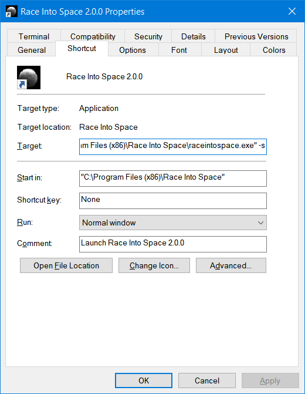

### Network News

Your turn will begin with a news broadcast, which includes three sections: Space news, World events, and Astronaut/Cosmonaut news.  Space news is at the top and can have a direct bearing on your space program: sometimes it helps or hurts you; other times it's informational or fluff.  World events is a top news item from the time period, but doesn't affect your space effort.  Astronaut/Cosmonaut news consists of announcements about your spacepeople: when they graduate from basic training, announce retirement, etc.  You may also see miscellaneous items such as the result of a Mars, Jupiter, or Saturn flyby.

There are several newscasts which sound like they will affect your space program but which you can safely ignore.  These are carryovers from *Liftoff!*  which were never fully implemented in BARIS.  Examples include: the next mission has a 50% chance of exploding on liftoff; you must fly Duration E before attempting a Moon landing; and some special task is required, such as flying a spy satellite on your next launch.  Also, Eisenhower's announcement that the space program will be canceled after a couple manned flights reflects his historical lack of enthusiasm for space; it will not affect you.

### Spaceports

After the news report you will be taken to an overhead view of your country's space facility: The Cape (Cape Canaveral) for the US, and Baikonur for the USSR.  Early in the game, your spaceport will have a fairly sparse look to it, with just a few buildings.  As time passes and you begin various projects and hire people for them, new buildings will appear and others will be expanded.

To run your space program, you will need to visit the buildings in your spaceport, to do everything from buying and researching hardware to planning missions and assembling them for launch.  You visit a building by clicking on it, or pressing the appropriate key on the keyboard.  As in most parts of the game, pressing F2 here will list those keyboard commands, and F1 will give you information about what's on the screen: in this case, a general idea of what the various buildings are for.

At the bottom of the screen, the name of the currently highlighted building is displayed, along with the current turn and, on the far right, how much money you have available for the remainder of the year.

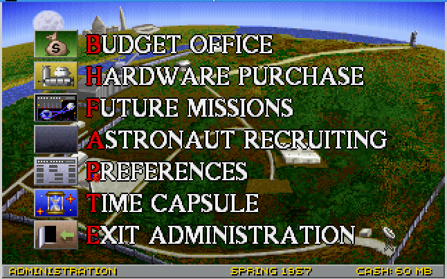

### Administration Building

Five offices are located here:

#### Budget Office

On the left you see one graph displaying your and your opponent's prestige over the past two years, and another showing selectable information on your expenditures in the four different classifications of space hardware.  On the right you see your budget over the past two years, next to an estimate of your opponent's, courtesy of the CIA/KGB.

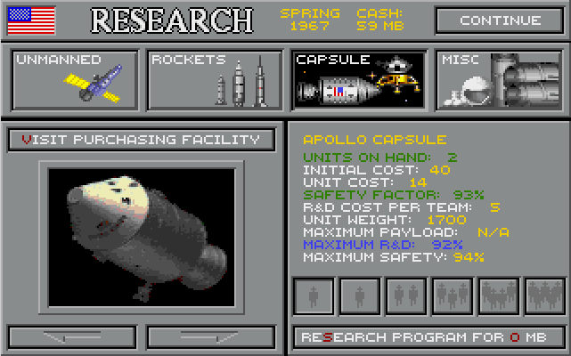

#### Hardware Purchase

This is where you start new programs or buy additional hardware.  Everything here is potentially useful, but not all of it will be needed.  For instance, lunar landers will be unnecessary if you have chosen direct ascent or the Kicker-C.  Note that you can never have more than 6 of any component at any given time.

There is a built-in advantage to developing programs in progressive order, called technology transfer.  If, for instance, you have researched your Mercury capsule to a high level and then begin the Gemini program, your Gemini capsules will start off at a higher Safety than if you had skipped Mercury.  The same would happen for Apollo if your Gemini was highly reliable; however, Apollo wouldn't get very much technology transfer from Mercury.  Jupiter would get very little from Mercury, and XMS-2 will get none in any case since it's a completely different sort of spacecraft.

In BARIS, this was all or nothing.  If a component wasn't quite at 75%, it would give no tech transfer at all.  RIS (starting with v.1.1) gives partial tech transfer when your hardware is above starting Safety.

Technology transfer is a good and useful thing, but you don't have to take advantage of it.  It will sometimes be in your interest to skip programs or take alternate paths to your objective.  You will get a feel for this over time.

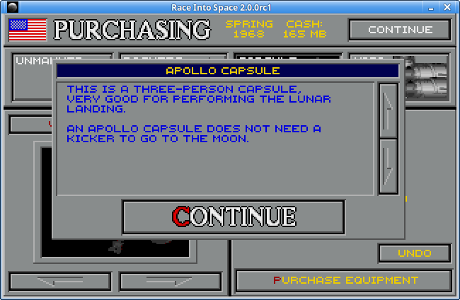

If you click on the image on the left, you'll see a pop-up description of that piece of hardware.

The "Visit  R&D Facility" button is a shortcut to your Research building.  You can't just start, say, a capsule program and use it immediately; you first have to invest time and money to make it spaceworthy.

There are four categories of space hardware:

<table>
<tr>
  <td>Satellites:</td>
  <td>Launch Vehicles:</td>
  <td>Manned Spacecraft:</td>
  <td>Miscellaneous:</td>
</tr><tr>
  <td valign="top">Explorer/Sputnik 
    Ranger/Cosmos 
    Surveyor/Luna</td>
  <td valign="top">Atlas/R-7 
    Titan/Proton 
    Saturn/N1 
    Nova/UR-700 
    Boosters</td>
  <td>Mercury/Vostok 
    Gemini/Voskhod 
    Apollo/Soyuz 
    XMS-2/Lapot 
    Jupiter/LK-700 
    Eagle/LKM 
    Cricket/LK</td>
  <td valign="top">Kicker-A 
    Kicker-B 
    Kicker-C (USSR only) 
    EVA Suit 
    Docking Module</td>
</tr>
</table>

##### Satellites

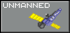  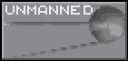

* Explorer/Sputnik: A simple satellite which can only be used for the Orbital Satellite mission.  However, the Safety rating of this device is what's rolled against on the Hardware Power-On step of Docking tests, so a high Explorer/Sputnik Safety is helpful unless you're flying direct ascent.
* Ranger/Cosmos:  A flyby probe, which can be sent past the Moon or any of the planets out to Saturn.  So Voyager isn't an option in this game, but with two probes you can (sort of) recreate Pioneer 10 and 11.  A very good way to gather lunar reconnaissance.
* Surveyor/Luna:  A lunar landing probe.  Unlike Ranger/Cosmos it can't be sent to other planets, just the Moon; it may, however, act as a lunar flyby probe if it should miss the Moon, giving you some photo recon.

##### Launch Vehicles

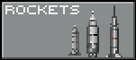  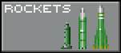

* Atlas/R-7: Light-duty rocket; can't send anything beyond Earth orbit, even with boosters (unless you set `atlasLunar 1` (or any non-zero number) in Advanced Preferences, not recommended).  The R-7 was known as A-Series in BARIS.
* Titan/Proton: Medium-duty rocket; normally the minimum for sending anything to the Moon or beyond.  Can be used to launch Joint docking and LM tests and Joint lunar landings.
* Saturn/N1: Heavy-duty rocket, known historically as "Moon rockets".  Required for launching a Single LM Test or the Historical Lunar Landing.  The N1 was called N-1 in BARIS, and the Saturn was called Saturn V though RIS 1.1.
* Nova/UR-700: "Mega"-duty rocket, required for direct ascent capsules.  The UR-700 was called Vulkon in BARIS (historically, it would have been an expanded version of the Proton, whose designation is UR-500).
* Boosters: Added to rockets (except Nova/UR-700) to let them lift heavier payloads.  They make missions a bit riskier, but less expensive. 

##### Manned Spacecraft

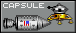 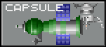

* Mercury/Vostok: One-person capsule; very simple, limited to suborbital, orbital, EVA, and Duration B.
* Gemini/Voskhod: Two-person capsule; most basic lunar-capable craft.  Requires a kicker to go to the Moon.
* Apollo/Soyuz: Three-person capsule, very lunar-capable.  Includes built-in kicker and docking module.
* XMS-2/Lapot: Three-person reusable minishuttle; lunar-capable.  Requires a kicker to go to the Moon.
* Jupiter/LK-700: Four-person direct ascent capsule.  Does not require kickers, docking modules, or lunar modules.  The LK-700 was called Kvartet in BARIS.
* Eagle/LKM: Two-person lunar lander; can be used with Apollo/Soyuz or XMS-2/Lapot.  The LKM was called Duet in BARIS.
* Cricket/LK: One-person lunar lander; required for Gemini/Voskhod.  More costly than Eagle/LKM due to extra backups and automated systems needed to compensate for lack of a second pilot.  The LK was called L-3 in BARIS.

##### Miscellaneous

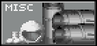 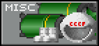

* Kicker-A: Used to send a Gemini/Voskhod, XMS-2/Lapot, or an LM by itself, out of orbit toward the Moon.  Can push only one major component (capsule/shuttle or lunar lander), so can be used on LOR but not EOR or the Historical Lunar Landing.  It can be used for a Joint Lunar Orbital LM Test, but again, LOR only.
* Kicker-B: Used to send a Gemini/Voskhod or XMS-2/Lapot, plus an LM, out of orbit toward the Moon.  Can push one or two major components (capsule/shuttle and lunar lander), so can be used on LOR, EOR, or Historical missions.
* Kicker-C: Soviet-only technology.  Replaces lunar modules; lands a Soyuz capsule on the Moon and lifts it off for return to Earth.  Cannot be used with any other type of spacecraft.
* EVA Suit: Required for spacewalks and lunar landings.  These are different from pressure suits and are not needed on missions where the crew stays inside the spacecraft.
* Docking Module: Required for missions involving docking.  Their power-on step is rolled against the Explorer/Sputnik safety.  This is the only component that cannot be researched—it must be tested to improve its safety.  Gains 10% from successes, 5% from failures.

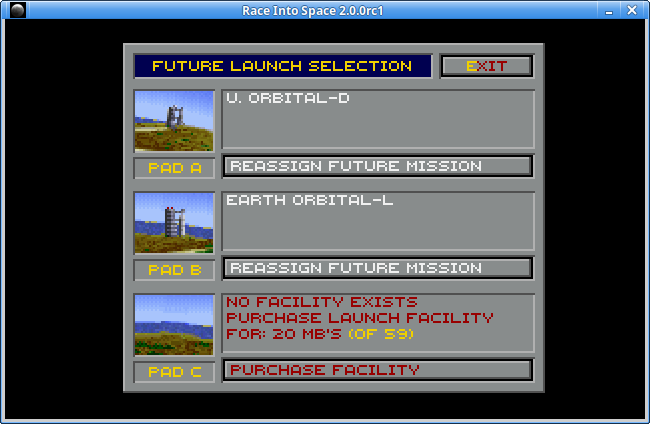

#### Future Missions

To put things in space, you have to schedule a mission one turn in advance; in Spring you'd schedule a launch for next Fall, and in Fall you would schedule one for next Spring.  This is done in the Future Missions Office.  Here you will see your launch pad(s) and any missions currently scheduled for next turn.  You start the game with one pad and can purchase up to two more as needed.  

To schedule a flight, select the pad you want to use.  If you have at least two pads, you have the option of scheduling a Joint mission, which involves two launches.  Joint missions complicate things a bit, but can be very useful when you want to do something that involves two or more components but you don't have the rocketry to lift them all at once: mostly docking tests, LM tests, and lunar landings.  To schedule a Joint mission you would select the first of the two pads you want to use.  Joint missions are always assigned to adjoining pads: either A and B, or B and C—not A and C.

In the top left in the gray area you will see the selected pad, and the mission's name, type, and duration.  Below that are five buttons you can use to narrow your options to help find the mission you want.  The first restricts your selection to unmanned vs. manned; if manned, it will include a pie chart representing the duration level of the mission, from A to F.  Next is a toggle for missions that include docking, then EVA, then LM, then Single vs. Joint.  In the bottom right of each is a smaller box (called a piano key) which locks that button in its current position.  The RESET button will clear everything.

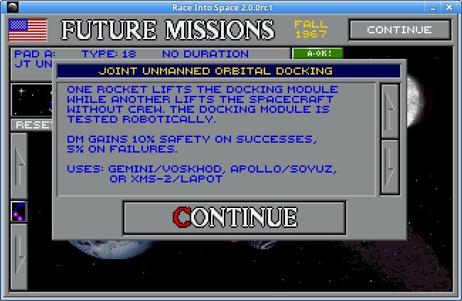

Clicking on the mission name box will show a pop-up describing the mission, as above.

To the right of the name box are the milestone risk and safety risk indicators.  If you've skipped a milestone (say, if you're scheduling an Orbital without having first flown a Suborbital), each step of that mission will suffer a -3% safety penalty; these are cumulative, of course, as in the very premature lunar landing shown below.  If you've skipped a _duration_ level you're docked 5 percentage points, which are also cumulative.  If you haven't flown this type of mission before and it represents a milestone step, even if you haven't skipped anything, you'll suffer a -1% penalty because there's always a little extra risk the first time you try something.  

The milestone risk bar classifies it as A-OK, CAUTION, or DANGER.  The box just below it shows the total penalties on a mission, and now acts as a button that opens a pop-up breaking down those penalties (above).  In this example the mission would be skipping 3 milestones (Lunar Probe Landing, Lunar Pass, and Lunar Orbital), 2 duration levels (the player has performed only A and B), it has the new mission penalty because it's a milestone step that the player hasn't flown before, plus the LM steps of the lunar landing itself will each face a 9-point penalty because the player has not gained any LM points.

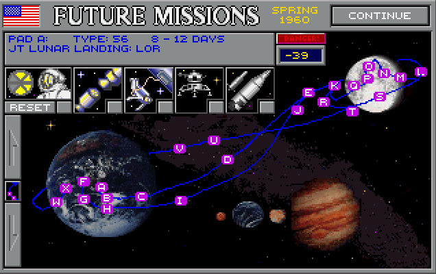

The bottom area shows the Earth, Moon, Mercury, and Venus.  It will also display Mars, Jupiter, and Saturn when those planets are available for probe flybys.  On the left are up and down arrows you can use to scroll through the available missions.  Between them is a button which will show the steps involved in the currently selected mission, as above.

Once you have selected the mission you want, click Continue or press Enter.

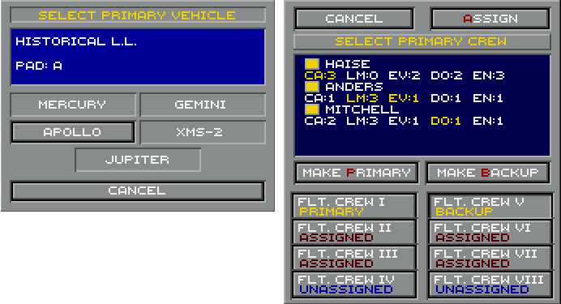

If this mission involves a capsule or shuttle, you'll be prompted to select which you want to use, as shown in the lefthand image above.  If this is a manned mission, you will then select crews for it as in the righthand image.  In BARIS, crews currently in Training (meaning they had been assembled that turn) could not be assigned to a mission; they had to wait a turn first.  In RIS this is no longer necessary, unless you set `no_c_training 0` in Advanced Preferences.  Similarly, BARIS required you to assign both a primary and backup crew to each mission.  RIS allows you to select only a primary if you wish, though you can make backup crews required again by setting `no_backup 0` in Advanced Preferences.

#### Dummy Tests

Once your hardware reaches Max R&D, it's impossible to further improve it through research, yet it may not be safe enough to risk lives with.  So it's often advisable to fly it on real, but unmanned, missions.  This puts the hardware through its paces and increases its Safety by 1% per mission, so long as it performs successfully on at least one step of the flight.  Dummy tests don't gain or lose you prestige, but they offer a safe way to improve your hardware.

In BARIS, dummy tests flown below Max R&D would give the player no advantage beyond a simple 1% Safety, effectively discouraging aggressive testing.  RIS avoids this by raising the Max R&D by 1% on each flight (again, so long as the hardware succeeds on at least one step), which can make it helpful to fly dummy tests before research is complete.  (Catastrophic failures will still reset the Max R&D to its original level, to avoid disrupting game balance.)  This behavior can be reset to the way BARIS worked by setting `succesRDMax 0` in Advanced Preferences.

#### Astronaut/Cosmonaut Recruiting

If human figures appear in the box next to the name of this office in the Administration menu, then you are able to recruit people this turn.  You may recruit up to five groups of astro/cosmonauts over the course of the game.  Random events may give you three additional spacemen from the military, or make female candidates available (and required).  You can make women always available by setting `female nauts 1` in Advanced Preferences.

In the recruitment screen, you will see the number of available positions, with each selected candidate's name and skills.  New to RIS 2.0, by default all skills are shown at Astronaut Level 1, LM and EVA won't show at Level 2, and LM, EVA, and Docking won't show at Level 3.  Setting `show_recruit_stats 0` in Advanced Preferences will restore the Classic behavior, so that LM, EVA, and Docking will never be known during recruitment, the way the game used to work.  Candidate skills are as follows:

<table>
  <tr>
    <td>Capsule Pilot</td><td>This is added to all Capsule steps of a mission—generally, anything involving piloting, navigation, or shipboard operations.  Easily the most important skill, since it's rolled against multiple times per flight.</td></tr>
<tr><td>L.M. Pilot</td><td>This is added to LM steps of a mission—the actual testing of a lander, or flying it on lunar landings. Mostly irrelevant until late in the game.</td></tr>
<tr><td>E.V.A.</td><td>This is added to spacewalks and lunar EVA. Not very important, since these rarely fail in any case.</td></tr>
<tr><td>Docking</td><td>This is added to attempts at docking. Especially helpful midway through the game.</td></tr>
<tr><td>Endurance</td><td>This is added to Duration steps of duration missions, and astronauts with high EN have less chance of washing out of the space program (unless you set `game_style 1` or `use_endurance 0`).</td>
  </tr>
</table>

There is also a field for Service (where a candidate came from, e.g. which branch of the military), which was never implemented—but may be in future versions of the game.  

#### Preferences

Once the game has started, you can change only music and sound.

#### Time Capsule

Here you can save or load a game, or exit to the main menu.
 

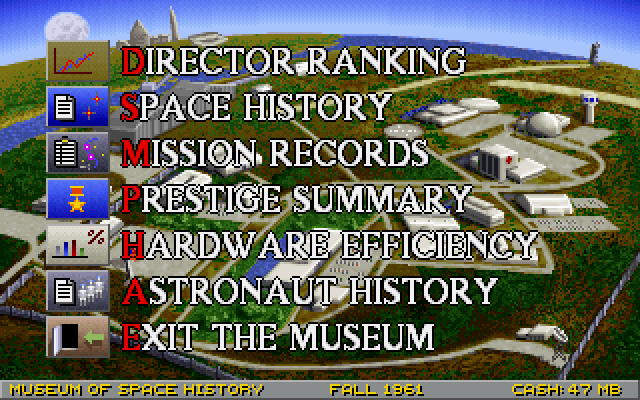

### Museum of Space History

The Museum offers various information on your space program and its accomplishments thus far.

#### Director Ranking

This shows your prestige compared to your opponent's, and how it has progressed over time.  The graph can give you some idea of how things are faring with your opponent—in particular, a sudden sharp drop usually indicates a catastrophic failure, which can take the pressure off you for a bit.  When deciding which approach to take to the Moon, this may give you some idea whether you're secure enough to take a chance on the more expensive options: minishuttle or direct ascent.

#### Space History

This shows a history of your space missions, one turn per screen.  Each mission you've flown is displayed with its name, an icon showing the type of spacecraft, and its mission patch.  Clicking on the mission will show its History screen, which gives more information on what it was about and who, if anyone, was aboard.  You can also replay it here if you wish.

#### Mission Records

This shows the three earliest accomplishments of each mission milestone in all games that have been played on this computer: first man in space, first spacewalk, etc.—in other words, who set the record for such-and-such in any game played on this machine.  Pressing the CLEAR RECORD button will reset the records for that category.

#### Prestige Summary

This shows who has gained how much prestige from performing various firsts, seconds, and so on in the current game.  It can help give you some idea where you are if you've lost track, and tip you off to types of missions you have already completed or which you may still need to accomplish but which may have slipped your mind, though it's somewhat awkward to use.

#### Hardware Efficiency

This will open to the Efficiency screen, which gives the success ratios of your various hardware programs.  If you click on the flag in the top left you will be taken to the Prestige Points screen, which shows the prestige points gained by each hardware program.  In practice, these screens aren't used much because they offer little information that would affect a player's decisions, though they do make an impressive-looking display.

#### Astronaut/Cosmonaut History

This shows detailed information about each of your spacepeople.  You can see their name and picture, what Group they were recruited in, how long they've been with you, their skills and location, and their mission history.

Someone who has flown at least once will show a pair of astronaut wings under their picture.  If they have accomplished a mission milestone or flown at least four space flights, you will also see a medal displayed.

### The Pentagon / KGB Headquarters

Here you can get secret intelligence on your opponent, starting in Fall 1958 (turn 4).  Of course, it isn't always accurate—in fact, it's wrong about half the time, give or take.  Still, this can be of some use in guessing what your opponent is doing, especially if you're considering whether to play it safe or take a big chance on a given prestige first.

#### Library

This is where to go for intelligence briefings.  Each fall you'll receive a report about your opponent's activities: developing a component, planning a particular mission, etc.  Again, this is often inaccurate, but it's one tool to help guess at your opponent's progress.

#### CIA/KGB Statistics

This shows the Safety ratings of your hardware, compared to your opponent's known and suspected hardware and estimated Safety, as revealed in previous Library reports.

### Capitol / Politburo

Once a year, your country's leader reviews your performance.  If you're doing very well indeed, you're likely to be praised; otherwise, you'll be sullenly urged to do better or even actively chastised.  If you're doing very poorly at game level 1, it will be suggested you retire.  At higher levels you'll be summarily fired, if you're playing against the computer; in a multiplayer game retirement will remain just a suggestion.

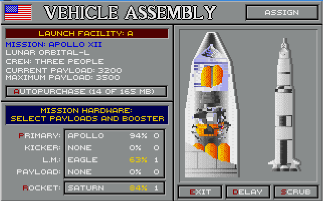

### Vehicle Assembly/Integration Building

If you scheduled a mission last turn, you now need to assemble it for launch.  In the top left you'll see the mission name and type, and an Autopurchase button to make it easy to buy the equipment for it.  On the right you see the hardware as currently assembled—when you change the configuration, this display will update to match it.  To change rockets or add/remove boosters, click on the Rocket button near the bottom left.  It defaults to the smallest rocket that can lift the payload without boosters; if you want to use a smaller rocket with boosters (e.g., B/Titan), click the button a few times.  Whatever the mission, your rocketry needs a high enough Maximum Payload to launch the Current Payload.  To change the payload (generally, to switch kickers or lunar landers), click on the larger button above the Rocket button.  Note that Autopurchase does not prompt you for confirmation (unless the rocketry can't lift the payload) and cannot be undone.

Once you're ready, click the Assign button or press Enter.  If you want to cancel out of this screen without assigning anything, press Exit.  If you want to cancel the flight entirely, press Scrub.  If your hardware isn't quite ready yet (like the LM in the above example) and you want to fly it next turn instead, press the Delay button.

It is often a good idea to make this your first stop when you begin your turn, so you don't accidentally spend all your money on research when you need to buy hardware for a launch.

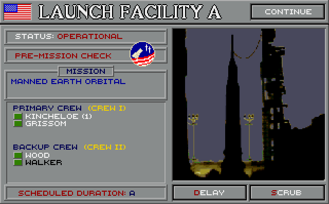

### Launch Pads A, B, and C

You start the game with one launch facility (Pad A) and can purchase more as needed.  If you click on one that has a launch going up this turn, you'll see the mission name, crew if any, and duration level, plus the mission patch.  Here too you can repair the pad or Scrub the mission if you so desire.  Note that in the example above, the second member of the backup crew shows in black, as he has announced retirement and will soon be departing the space program.

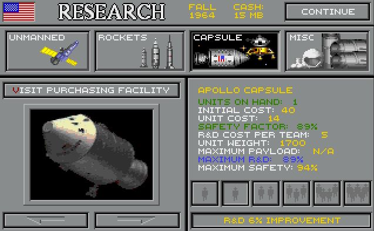

### Research & Development

This is the counterpart to the Purchasing building, where you can assign engineers to improve the reliability of your hardware—except docking modules, items that have already reached Max R&D, or anything you have not yet purchased.  The "VISIT PURCHASING FACILITY" button is, of course, a shortcut to the Purchasing building.

When a piece of hardware is prototyped, it begins with a low Safety factor.  If a capsule starts out above 6%, a rocket above 10%, or a probe above 40%, you've just seen the effect of technology transfer—the item is a bit safer from the get-go because some of it is is reused from older hardware (Gemini will receive technology from Mercury, for example).  As in Purchasing, clicking on the image of the selected hardware will bring up a description of it.

To increase the Safety of your hardware, decide how many engineering teams you want to assign to work on it this turn, and click the appropriate button above "RESEARCH PROGRAM", which shows what this amount of R&D will cost you.  This amount is, of course, the number of teams multiplied by the R&D Cost Per Team figure above.  When you press the button to research this program, the computer will roll a six-sided die for each team you've assigned, and add those rolls to the current Safety factor.  (If research is strong, it will instead roll a seven-sided die; if research is weak, it will roll a four- or five-sided die.)

Of course, once you reach Max R&D, you cannot improve the Safety of a component by researching it.  From this point, the only way to make it more reliable is to use it on an actual space mission.  It will gain 1% Safety per mission it flies, provided it works successfully at least once on the mission.  Once at Max Safety, of course, it's topped out.

### Moon / Luna

The Moon is shown up there to remind you of your objective.  Clicking on it will show your current level of lunar reconnaissance.  You begin the game at 55%, a rather simplified figure which reflects that a total of 55% of the Moon's surface is visible to Earth telescopes over the course of its orbit (so this is how much we had seen before Luna 3 took the first pictures of the far side).  Lunar recon will increase as you launch probe flybys and landings, and manned lunar passes and orbitals.

### Viewing Stand

The Viewing Stand shows some basic information on your previous missions, plus your newscasts.  If you missed the newscast by hitting a wrong key, or want to have a second look at it—or would like to see some of your prior newscasts—this is where to go.

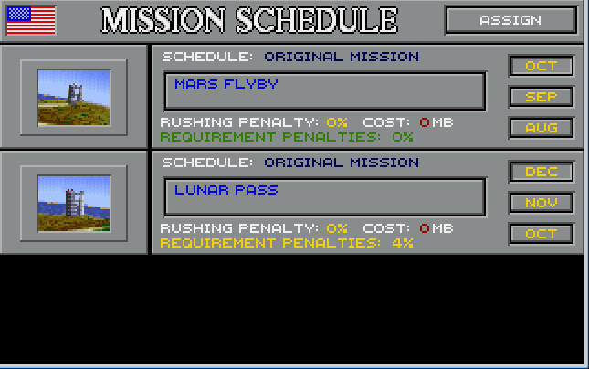

### Mission Control

If you have missions ready to launch this season, you must come here to confirm the launch schedule.  Here you can do two things to a given mission; one is to **rush** the launch by one or two months.  Rushing it by one month will cost 3MB and give a 3% milestone penalty; rushing it two months will cost 6MB and give a 6% penalty.  This isn't something you would do routinely, but it can be useful in beating your opponent to a prestige first, especially in multiplayer.

If one of your flights is riskier than you were prepared for, you also have the option to **downgrade** it to a simpler mission type.  This can be handy if, say, you had a Suborbital planned for last turn but the mission never flew—the Orbital now on the pad would suffer a milestone penalty from having skipped the Suborbital.  So instead you can downgrade it to a Suborbital and avoid the penalty.  There may be several options for a downgrade; for instance, the Orbital EVA Duration on Pad B above could be downgraded to Orbital EVA, Orbital Duration, Orbital, or Suborbital.  Once you choose a mission type and press the Assign button, however, you cannot change your mind.  You could go back and downgrade some more (say you downgraded from Orbital Duration EVA to Orbital EVA—you could downgrade further to an Orbital), but you cannot go back to the original mission without scrubbing and rescheduling.

New to RIS 2.0, you can also downgrade the duration level of a mission: so if you schedule a Duration C one turn and a D the next, and the first mission doesn't accomplish Duration C, you can downgrade the D to a C.  That way you don't have to choose between canceling and rescheduling or taking a big risk.

The Requirement Penalties figure shows the total of any penalties against the mission for skipping milestone steps or duration steps, or for being the first of this type of mission you've flown.  Clicking on the image of the launch pad on the left will open a pop-up window that breaks down those penalties, much like the safety risk button in Future Missions.

### Arlington Cemetery / Kremlin Wall

Your brave heroes who die while part of your space program (whether in the line of duty or from a random accident) will be laid to rest here.

### The Flagpole

Click on the flag to end your turn.  New to RIS 2.0, if you have no missions planned for next turn a warning will pop up: it's easy to forget to schedule a mission, especially in the middle of the game.  If you have missions scheduled for launch _this_ season, you will be given one last chance to review each one and give a final go-ahead, or instead scrub the flight.  This final confirmation screen can be especially important when you have two missions scheduled and the first suffers a catastrophic failure: you will get a final confirmation screen for the second flight, along with current Safety figures, and can cancel a mission that's suddenly become unacceptably dangerous.

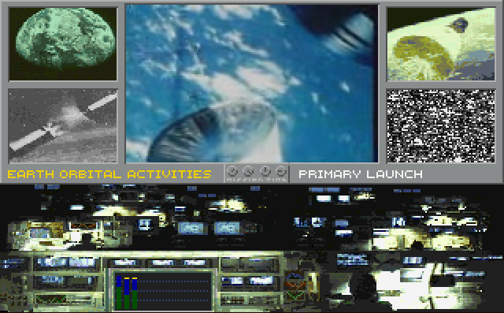

When your turn ends and your missions launch, you will watch them unfold.  Dummy tests and Unmanned Docking tests will display only the launch, but probes and manned missions show the whole thing (except Mars, Jupiter, and Saturn probes, since they take several turns to arrive).  On either side of the movie mission you will see still images of space hardware and other things space-related; at the bottom you'll see the mission's status box, which displays the die rolls for each step of the mission.  The colored bars represent your chances for success on that step; note that in the above example, the first step (Launch) has a taller bar, because the rocket has a higher safety than the capsule.  The green represents the number rolled against your hardware; the dotted lines are markers for 25%, 50%, and 75%.  The yellow caps at the top of the second and third bars are safety added by crew skill, in this case Capsule Pilot.  

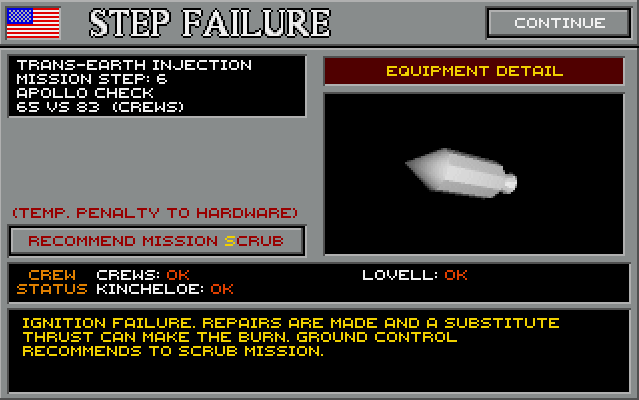

A red bar means a failed roll, which will be followed by a Step Failure screen.  Sometimes the problem is repaired by the crew (as above), especially if your hardware was pretty safe to begin with.  But sometimes, especially if it is under-researched, crew status will not be OK and you'll suffer a failure of some kind.  Failed rolls on unmanned missions always make the mission fail.  If the failed roll was for a step affected by crew skill, the crew member who failed the roll will show after the dice roll result (again, as shown).  Prior to RIS 2.0, the crew member's name was underlined instead.

You will see the computer's missions only when they represent successful prestige firsts.  Other missions, even prestige seconds, will not be displayed.

### Basic Training

The turn after you recruit your first group of spacepeople, a host of new buildings will appear to accommodate them.  The first place they go is Basic Training; you can withdraw them early at any time, but withdrawal is a one-way trip.  If you don't need people right away, it's recommended to leave them here for the duration, as that will improve their skills.  This is especially helpful for Capsule pilot, the most important skill—if you need to pull someone out early, anyone with a CA4 is a good candidate for withdrawal, and failing that a CA2 or less.  Anyone CA3 is best left in Basic if possible, as their skill might rise to CA4 if they're left alone.

After 3 turns, they leave Basic Training and go to the Astronaut Complex (US) or Cosmonaut Center (USSR).

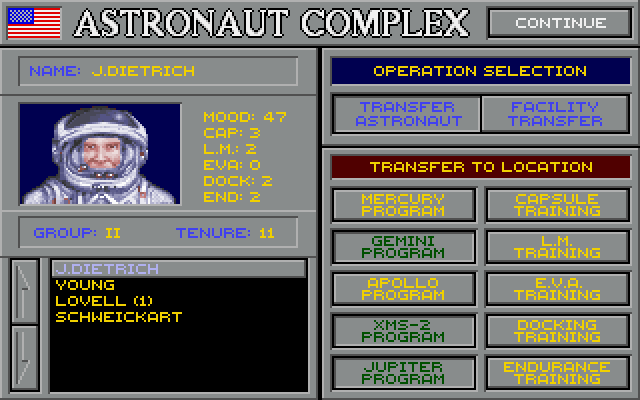

### Astronaut Complex / Cosmonaut Center

This is the distribution point for your spacepeople.  From here you can send them to a capsule or shuttle program, or to Advanced Training.  Leaving the Transfer Astronaut/Cosmonaut button selected, press the button for where you want the highlighted person to go.  To follow them there, or go somewhere else, select the Facility Transfer button and click on your destination.  Note that here and in many other places, your veterans will show the number of missions they've flown.  This can help you keep track of your veteran versus unflown spacepeople.

### Capsule/Shuttle Program

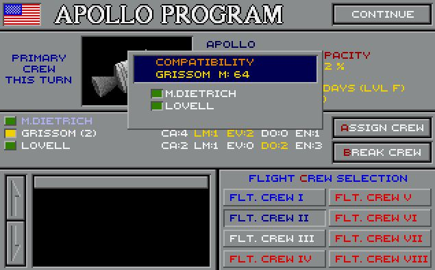

You can reach this screen from the Astronaut Complex / Cosmonaut Center, or by clicking on the appropriate building in the spaceport.  Here you can assign people to crews, once you've sent them here.  You can also break and reassign crews as needed.

Flight Crews shown in blue lettering in the bottom right are assigned to a mission for this turn, and cannot be broken without scrubbing the flight in Mission Control or the VAB/VIB.  Crews showing in green have been assigned to a flight next turn and also cannot be broken here—to do so you must first cancel their flight(s) in Future Missions.

When assembling crews, pay special attention to their compatibility.  Click on each member of a newly assigned crew to see how he/she gets along with the others; as you might expect, green is good and red is bad.  People who don't get along with their crewmates will lose morale and retire sooner than their colleagues.  Check all crew members, since compatibility isn't always mutual.

Also pay attention to each person's role—skills in yellow are those that will be used by that member of the team.  However, regardless of other considerations, you should always put your highest Capsule skill in the first seat, since that is most important to keeping the crew out of danger.  Also, anyone whose name shows in black or dark purple (such as Slayton above, who has flown a mission) has announced retirement and should not be assigned.  They'll just leave soon and break the crew anyway.

Anyone who is not assigned to a crew (or not assigned to a *full* crew) will return to the Astronaut Complex / Cosmonaut Center when you leave this screen.

Your spacepeople prefer being assigned to a crew (so long as it's a compatible one) to languishing back at the Complex/Center.  Space successes, especially firsts, improve the morale of all your people.  Failures and deaths are damaging to morale.  Your people also enjoy being assigned to the primary crew of a mission.

<table>
  <tr>
    <td>Color</td><td>Mood</td></tr>
<tr><td>Green</td><td>Happy</td></tr>
<tr><td>Yellow</td><td>Ok, could be better</td></tr>
<tr><td>Red</td><td>Frustrated</td></tr>
<tr><td>Black</td><td>Burned out, planning retirement</td>
  </tr>
</table>

### Hospital / Infirmary

When someone is injured, either during a mission or in some other accident, they will be sent here and hope to recover so they can return to active duty.  If so, they go to the Astronaut Complex / Cosmonaut Center; otherwise they will retire from your space program.

### Advanced Training

You may send some of your people to Advanced Training to improve their skills.  There's one Advanced Training building for each skill: Capsule, LM, EVA, Docking, and Endurance.  Advanced Training takes 2 full years (4 turns), and will award 2 points in the relevant skill.  It puts trainees out of commission for that time and costs 3MB apiece, so it's not used very often.

RIS 1.1 made several improvements to Advanced Training.  The game doesn't let you send anyone to Advanced for any skill they have a 4 in, since they can't benefit from it.  Anyone with a 3 in that skill will go directly to Advanced Training III, so they serve half the usual time since they can only gain half the amount of skill.

For anyone with a skill of 2 or less, it used to be that Advanced Training would give nothing until the end—then, after two years (four turns) they would gain 2 points all at once.  Now, half of the gain (1 point) is awarded after 2 turns, so someone withdrawn from Advanced III or IV will still get half credit for their time spent there.  Someone withdrawn from Advanced I or II won't gain any skill but will be eligible to go back to Advanced later on (those who have gained some are still prohibited from returning), and withdrawing someone from Advanced I, II, or III can gain the player a partial refund of the money originally spent to send them there.

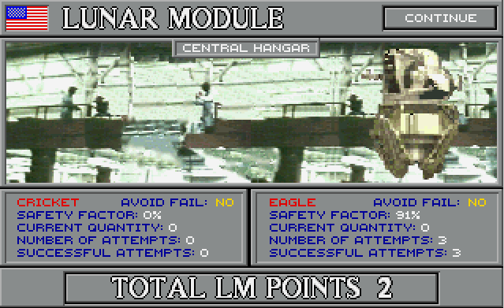

### L.M. Program

The LM Facility gives you some important information about your lunar module(s).  Current Safety is displayed here, and the number you have in your inventory, and it also shows whether your lander holds a failure avoidance card.  The number of Attempts represents not the number of tests a module has flown, but the total number of times it's been rolled against, reflecting what's shown in the Hardware Efficiency screen.

Last and most important, you see your current number of LM points.  Each successful Earth orbital test is worth one point; each lunar LM test is worth two.  If you don't have at least three points, the LM steps of your lunar landing mission will suffer a -3 penalty for each point you are missing.

LM Points are not specific to the lander they were earned with.  So, if for some reason you have purchased both landers (as above) and gained 3 points with one lander, you could use the other for the lunar landing with no LM penalty.

Direct ascent landings (Jupiter/LK-700) and Soyuz Lunar Landing (Soyuz + C-Kicker) do not require LM points, and in fact it is not possible to gain them using that hardware.

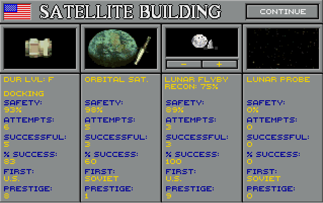

### Satellite Programs

The Satellite building shows information on several programs, mainly unmanned.  For lack of a better place to put it, RIS has shoehorned in an indicator of your highest currently achieved Duration level on the left.  Just below that is information on your docking attempts to date, both manned and unmanned, with number of Attempts meaning how many times the DM has been rolled against, similar to the figure in the L.M. Program building.  Next is information on your Orbital Satellite missions.  The third column shows your lunar flyby data, and offers buttons that let you scroll through the various planetary flybys.  Finally, the right column shows information on your lunar probe landings, if any.

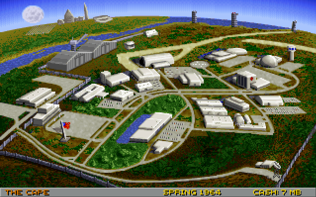

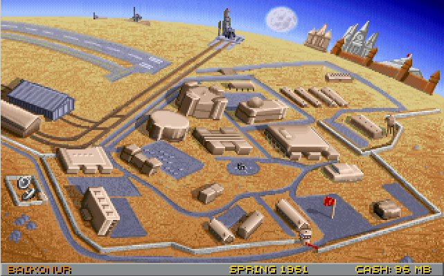

## PRESTIGE

<table>
  <tr>
    <td>Name</td>
    <td>First</td>
    <td>Second</td>
    <td>Other</td>
    <td>Failure</td>
  </tr>
  <tr>
    <td>Orbital Satellite</td>
    <td>12</td>
    <td>5</td>
    <td>1</td>
    <td>-3</td>
  </tr>
  <tr>
    <td>Lunar Flyby</td>
    <td>5</td>
    <td>3</td>
    <td>2</td>
    <td>-3</td>
  </tr>
  <tr>
    <td>Mercury Flyby</td>
    <td>5</td>
    <td>2</td>
    <td>2</td>
    <td>-3</td>
  </tr>
  <tr>
    <td>Venus Flyby</td>
    <td>7</td>
    <td>4</td>
    <td>2</td>
    <td>-3</td>
  </tr>
  <tr>
    <td>Mars Flyby</td>
    <td>7</td>
    <td>4</td>
    <td>2</td>
    <td>-3</td>
  </tr>
  <tr>
    <td>Jupiter Flyby</td>
    <td>8</td>
    <td>4</td>
    <td>2</td>
    <td>-3</td>
  </tr>
  <tr>
    <td>Saturn Flyby</td>
    <td>9</td>
    <td>4</td>
    <td>2</td>
    <td>-3</td>
  </tr>
  <tr>
    <td>Lunar Probe Landing</td>
    <td>16</td>
    <td>9</td>
    <td>2</td>
    <td>-5</td>
  </tr>
  <tr>
    <td>One-Person Craft</td>
    <td>3</td>
    <td>1</td>
    <td>0</td>
    <td>0</td>
  </tr>
  <tr>
    <td>Two-Person Craft</td>
    <td>7</td>
    <td>2</td>
    <td>0</td>
    <td>0</td>
  </tr>
  <tr>
    <td>Three-Person Craft</td>
    <td>15</td>
    <td>5</td>
    <td>0</td>
    <td>0</td>
  </tr>
  <tr>
    <td>Minishuttle</td>
    <td>20</td>
    <td>8</td>
    <td>0</td>
    <td>0</td>
  </tr>
  <tr>
    <td>Four-Person Craft</td>
    <td>20</td>
    <td>8</td>
    <td>0</td>
    <td>0</td>
  </tr>
  <tr>
    <td>Duration Level B </td>
    <td>3</td>
    <td>3</td>
    <td>0</td>
    <td>0</td>
  </tr>
  <tr>
    <td>Duration Level C</td>
    <td>5</td>
    <td>5</td>
    <td>0</td>
    <td>0</td>
  </tr>
  <tr>
    <td>Duration Level D</td>
    <td>1</td>
    <td>1</td>
    <td>0</td>
    <td>0</td>
  </tr>
  <tr>
    <td>Duration Level E</td>
    <td>5</td>
    <td>5</td>
    <td>0</td>
    <td>0</td>
  </tr>
  <tr>
    <td>Duration Level F</td>
    <td>7</td>
    <td>7</td>
    <td>0</td>
    <td>0</td>
  </tr>
  <tr>
    <td>Manned Orbital</td>
    <td>12</td>
    <td>5</td>
    <td>1</td>
    <td> -10*</td>
  </tr>
  <tr>
    <td>Manned Lunar Pass</td>
    <td>12</td>
    <td>5</td>
    <td>2</td>
    <td> -10*</td>
  </tr>
  <tr>
    <td>Manned Lunar Orbit</td>
    <td>20</td>
    <td>7</td>
    <td>1</td>
    <td> -10*</td>
  </tr>
  <tr>
    <td>Manned Lunar Landing</td>
    <td>40</td>
    <td>15</td>
    <td>8</td>
    <td> -10*</td>
  </tr>
  <tr>
    <td>Manned Orbiting Lab</td>
    <td>6</td>
    <td>4</td>
    <td>0</td>
    <td> -10*</td>
  </tr>
  <tr>
    <td>Manned Docking</td>
    <td>8</td>
    <td>4</td>
    <td>1</td>
    <td>-3</td>
  </tr>
  <tr>
    <td>Woman in Space</td>
    <td>8</td>
    <td>0</td>
    <td>0</td>
    <td>-4</td>
  </tr>
  <tr>
    <td>Spacewalk</td>
    <td>8</td>
    <td>4</td>
    <td>1</td>
    <td>-3</td>
  </tr>
  <tr>
    <td>Manned Space Mission</td>
    <td>15</td>
    <td>5</td>
    <td>0</td>
    <td> -10*</td>
  </tr>
</table>
  * Missions with a -10 for failure will instead suffer -7 to -10 if no crew deaths occur.

## MISSION MILESTONE STEPS

Space exploration was something completely new in the 1950s and early 60s.  Space could be filled with a host of dangers to human beings and living things generally—and some of those turned out to be real.  Rushing ahead heedless of those possibilities would have been foolhardy.  We sent probes up above the atmosphere to see what was there, and discovered the Van Allen Belt.  Then we sent animals into space: generally, the US used primates and the Soviets used dogs.  Finally we sent up humans, briefly at first, and for longer periods as we learned more about how the human body reacts to weightlessness.  We learned, for instance, that early fears of astronauts losing control of their reasoning were unfounded; however we also discovered unexpected effects such as space sickness and gradual loss of bone and muscle mass, which have to be taken into account on longer voyages.

Before the US sent anyone into orbit it tossed a couple astronauts into space on suborbital missions (of course the Soviets skipped that one, as you can in the game).  And both sides performed a number of simple orbitals before attempting long durations or spacewalks.  Duration, EVA, and docking were all well under our belt before the US ventured beyond Earth orbit, and the Soviets never did—though they did send animals around the Moon.  Race Into Space models the importance of incremental progress by assigning extra risk to missions that skip milestone steps.  Skipping is useful sometimes, but is not something to be done lightly.  Each milestone skipped carries a -3% penalty on each step of the flight, so if you skip two milestones for a mission, every step will suffer -6%.  Of course if it succeeds, you'll get credit for having accomplished those milestone steps and won't be penalized for them again.

Similarly, the game assigns a -5% penalty for each *duration* level skipped: for instance, if you had just completed a Manned Orbital (Duration A) and planned a Duration D for next turn (skipping B & C), that mission would suffer -10% per step.  Duration penalties are cumulative with any milestone penalties, of course.  Finally, any new milestone mission will suffer a -1% New Mission penalty, modeling the little extra risk you take when trying something new.

### ORBITAL SATELLITE

Humanity's first step in space exploration would likely be putting a simple satellite into orbit around the Earth.  Historically this was an event of enormous importance, and in the game it makes an ideal first step on the road to space.  Remember that strategically, Sputnik put the US on notice that the Soviets could drop a bomb anywhere in the world, which was new and shocking at the time.

### MANNED SUBORBITAL

Typically a country's first manned space mission will be a suborbital flight, which tests out the spacecraft to see how it and its pilot perform in the harsh environment of outer space—while avoiding some of the risks of a full orbital mission.  There is no chance of failure to deorbit, for instance, and the heat of reentry is much less than for an orbital mission (though these differences don't apply in-game).  Putting a human being into space for the first time, even if only for a few minutes, is still a big deal, and counts as a Manned Space Mission prestige first.

### MANNED ORBITAL

Putting a human into orbit is also a major achievement.  The spacecraft's systems are put to more thorough tests and the effects of microgravity on the human body are studied in more detail than can be done in a suborbital.  It is possible, though riskier, to skip the suborbital and go straight to an orbital mission, combining the two prestige firsts, as the Soviets did with Yuri Gagarin on Vostok 1.  The manned orbital also paves the way for more demanding and complex missions, such as longer duration, spacewalks, and docking tests. 

### LUNAR FLYBY

Sending a probe past the Moon is an important step toward sending people out that way.  It allows your program to study the surface features and gives humanity its first look at the Moon's far side, plus this will be the first man-made object to permanently leave Earth.

### LUNAR PROBE LANDING

Before landing people on the Moon, it is helpful to first put down a robotic probe.  This tests the concept of soft-landing a spacecraft, and allows testing the firmness and composition of the lunar soil (technically, regolith).  It also helps with lunar reconnaissance.  (It is not so important in the game as it was in real life; in RIS this is no more than a milestone step for the lunar pass, and isn't hard to skip.)

### MANNED LUNAR PASS

Sending people around the Moon and back to Earth is a big step for mankind, as it is our first visit of any kind to another celestial body.  Earthrise can be viewed from another world for the first time, and photo recon will be gathered.

### MANNED LUNAR ORBITAL

More involved than a pass, a lunar orbital gives ample opportunity to test out spacecraft systems in lunar space, and even lunar lander tests above the Moon as was done on Apollo 10.  One can even skip the lunar pass and go straight to the orbital as was done on Apollo 8, though that's awful risky if you've also skipped the lunar landing probe.  The orbital also provides some opportunity for the gathering of lunar recon.

### MANNED LUNAR LANDING

This is it, the end goal—to land someone on the Moon and return them safely to Earth.  This is arguably humanity's greatest technological triumph!  New challenges await, but mankind's first footsteps on an alien world are an achievement to remember.

## Other Milestones, and Important Tasks for the Moon Landing

### PHOTO RECONNAISSANCE

Lunar recon represents your space program's ability to find a safe landing spot once your people approach the lunar surface; what looks smooth from a distance could turn out to be a very rough landing site.  A failed photo recon step can result in a last-minute abort to your lunar landing, or worse.  Lunar recon starts at 55%.  It increases 5% with every probe flyby, manned lunar pass or orbital, or failed probe landing (so long as the probe manages a lunar de-orbit burn).  Successful probe landings raise your reconnaissance by 15%.

### SPACEWALK

Before you can consider walking on the Moon, it's important to establish that human beings can perform outside a spacecraft at all.  EVA is an important achievement in its own right, and is a (near literal) first step for mankind.

### (MANNED) DOCKING

Docking is a capability required for any lunar landing except direct ascent.  Rendezvous and docking are much more complicated in space than on the ground, and there was a great deal of skepticism that it could be mastered in time for a Moon landing in the 1960s.  It wasn't easy for either side, and the game models that by requiring multiple tests of the docking module, many of which fail—especially early on.  Docking modules begin with a 40% Safety which increases only with testing: 5% for failed dockings, 10% for successes.

### DURATION

Once your space program has performed a simple Earth orbital, it's time to consider longer flights, to see how people perform in space for extended periods.  Certainly they'll have to be able to go for 8-12 days, as lunar orbitals and landings are Duration D missions.  Longer duration isn't necessary (good news if you're flying minishuttles), but earns the player extra prestige.  It's important to raise your duration level by incrementally flying Duration missions, since skipping a duration level carries a -5% duration penalty.  That is, if you fly an Orbital (Dur A) followed by a Duration B mission you're fine, but if you went directly from A to C you would face a penalty.  You would also have a duration penalty if you had flown Duration B and then flew a Manned Lunar Pass or Manned Orbiting Lab, which require Duration C.  Duration levels are as follows:

<table>
  <tr>
    <td>Days</td>
    <td>Level</td>
    <td>Prestige</td>
    <td>Comments</td>
  </tr>
  <tr>
    <td>1-2</td>
    <td>A</td>
    <td>--</td>
    <td>Any space mission will be at least Duration A</td>
  </tr>
  <tr>
    <td>3-5</td>
    <td>B</td>
    <td>3</td>
    <td>Maximum for Mercury/Vostok</td>
  </tr>
  <tr>
    <td>6-7</td>
    <td>C</td>
    <td>5</td>
    <td>Duration level required for manned orbiting lab or lunar pass</td>
  </tr>
  <tr>
    <td>8-12</td>
    <td>D</td>
    <td>1</td>
    <td>Maximum for XMS-2/Lapot; Duration level required for lunar orbitals and landings</td>
  </tr>
  <tr>
    <td>13-16</td>
    <td>E</td>
    <td>5</td>
    <td>Maximum for Gemini/Voskhod</td>
  </tr>
  <tr>
    <td>17-20</td>
    <td>F</td>
    <td>7</td>
    <td>Maximum for Apollo/Soyuz and Jupiter/LK-700</td>
  </tr>
</table>

### LUNAR MODULE TESTS

Lunar Modules should ideally be tested before they're used for the actual landing.  RIS uses a system of LM Points to model this.  To avoid penalties on your landing you need 3 points, which you get from LM tests, which are always manned.  Tests in Earth orbit are worth 1 point; those in lunar orbit are worth 2.  You could run three Earth-orbital tests to get your three points, or one Earth-orbital and one lunar-orbital (as happened with Apollos 9 and 10).  You could do two lunar-orbital tests if you wished, though there's no advantage to accumulating more than 3 points.

If you have under 3 points, your lunar landings will face a penalty on the LM portions of the landing.  Each LM step will be docked 3% per missing point, so if you performed no tests, you would face a 9% penalty; if you performed just one Earth-orbital test, you'd be docked 6% on those steps.  Direct ascent capsules do not require LM tests; neither do Soyuz Lunar Landings, which use a Kicker-C in place of an LM.  In fact you cannot perform LM tests with either of these (except that a Soyuz Lunar Landing can be downgraded a Lunar Orbital LM Test, if you really want to test your C-Kicker before landing with it—but it doesn't give LM Points for those tests, just the usual 1% Safety.)

## STRATEGY

by Fritz Bronner

### How I Won and Lost the Moon Race

Kennedy's challenge of landing men on the Moon and returning safely to the Earth is the ultimate goal of winning the space race.  It is especially challenging, when starting with a meager budget and...fledgling space program.

As Director or Designer you need to make decisions on short term goals in order to achieve the long terms and only then should lunar missions be attempted.  Possible short term goals could be, an orbital satellite or sending a man in space.  You must decide whether the risks of skipping milestone steps are worthwhile in order to complete your goals.  There are a lot of different directions to choose from, [so] just keep the overall picture in mind.

Success breeds confidence and more support, meaning funding and growth.  Failure can only mean setbacks and should be avoided.  Loss of life should be avoided at all costs!

### Space Hardware and R&D

Determine which types of hardware you are going to develop in your space program.  Program and R&D costs must be evaluated carefully.  A program's payload weight should be compared to various rocket program lift capabilities.  Compare the safety factors of various programs.  Programs that are inexpensive are generally not as reliable.  The advantage is a quick way into space.  The disadvantage is without numerous dummy tests, a catastrophe isn't far away.  Buying expensive programs too early can trap you into a long R&D phase and your opponent ends up further ahead with more funds and better high-tech hardware.

The trick is to buy only the programs that you currently need in order to complete your current objective.  Streamline your short term goals so that some of the hardware you're using now can be used in the later stages.  Even if some hardware is not designed for certain missions, use that hardware for other important tasks.  Timing is crucial when determining to purchase new programs.  If you purchase expensive high tech programs too early, a depleted budget limits the number of space missions with your inventory.

### To the Moon

There are twenty [ed. note: actually, 21] different ways to send 'nauts to the moon.  It's worthwhile to decide early on which of these approaches you prefer.  If obstacles arise that are too difficult or could delay a mission or become too costly, be flexible and adapt.  Always have contingency plans for short term goals and going to the moon.  If one program fails, there are alternative ways of completing the same goal.

Each of the twenty approaches to the moon can be successful.  Depending on your planning mission success and available funding, at certain times some approaches become more advantageous.  With proper wits, and a little luck, forging your own path can be just as successful.  Immediately jumping into the more advanced manned programs, such as the three-man capsule, mini-shuttle, or the four-man module, will take several years to develop with very little space flight activity in the interim.  Balancing these programs with some [successful minor prestige] programs (planetary satellites, EVAs and space duration with smaller capsules) can assist reaching victory.  Otherwise your budget can remain static and leave you behind in the race.

Sometimes, you're going to have some tough choices when it involves cutting safety in order to beat your opponent.  Caution is always recommended.  Let the other country take the risks.  Even if they get ahead early on, it is likely that they will trip-up at some point.  If they are remarkably lucky for eight or ten years (this would be rare), only at the very end should you resort to last gap measures.  Take big risks on unmanned missions[;] that can garner some prestige points.

Be sure to build up your space endurance and docking skills in Earth orbit before attempting any ambitious lunar missions.  With careful planning, docking, LM tests and duration can all [be] achieved within several years.  But only on a good foundation of proper R&D and numerous dummy tests.

History is a good example of what to follow.  Target the easy prestige milestones first.  Try for first satellite or a manned sub-orbital or orbital.  Notice how many times the Americans and Soviets performed dummy tests on their programs before launching men into space.  It's not necessary to follow every step through; be creative.

## REALISM

by Fritz Bronner

As designer, I have debated the issue of realism for several years.  In this game there are images of rocket explosions, funerals, and other unpleasant events.  This footage is real and the flesh and blood of people were involved.  It includes not only national heroes, but families and friends who have lost their loved ones.  Death is indiscriminate toward nationality as the Americans and Soviets mourned their losses equally.  This simulation is meant to be historical.  It is not about war, its glorification, or nameless statistics.

My whole intention with this game is to educate children and adults about man's early exploration of space.  The public in general is unaware of who participated in this adventure as a generation has separated current times from the Apollo decade.  Very few can name the first two men who walked on the moon and even fewer know how many Soviets and women have walked on her.  It is amazing that the public has such little knowledge of man's greatest technological achievement: landing men on the moon.  So many names of those involved are forgotten.  Even those who tragically lost their lives are nothing but a void.

The space program is a high risk business.  A great emphasis is made on minimizing those risks, but catastrophic accidents can happen.  For the near future, going into space will never be routine like riding in an airliner.  In this simulation, the player is held responsible and accountable for the loss of life.  Safety is strongly encouraged and the player who ignores this is punished.  If this is to be a realistic simulation, the possibility of catastrophic failure must be included without sugar-coating the issue.

There are too many slick graphic games that display death with no consequences.  In this simulation, film footage of catastrophic events is not meant to take advantage of or harm the relatives and survivors of these events.  The intention is to educate [about] the sacrifices that these individuals made.  This footage exists, and is part of history.  If in any way it can inform and teach people what really happened, then I feel it is worth it.  The other choice is to let the film collect dust and history be forgotten by all.

Many speak of the trauma for the children and adults who viewed the Challenger disaster.  Yes, it was very disturbing, but they recovered and moved on as did NASA.  They had to.  If they did not, then there was no purpose in the lives that were lost.  Out of the ashes of death, a new life will emerge.

On Jan. 27, 1967, a ten-year old Cub Scout toured NASA and saw America's proud new spacecraft, Apollo 1.  Within the hour, Grissom, Chaffe[e] and White were dead.  The boy cried, the nation mourned, and an investigation found the cause.  Out of the ashes a new standard emerged[:] a resolve for even greater safety.  Within eighteen months the Apollo spacecraft flew and shortly after, men walked on another world.  The boy also found a purpose.  Life goes on and mankind learns from its mistakes.

## MISSION DESCRIPTIONS

These are all the mission types available in the game.  You'll never fly all of them in one game, and most likely there are some you will never fly.  Milestone steps are cumulative: so flying the Orbital without having flown the Orbital Satellite or the Manned Suborbital will incur two milestone penalties.  Examples given should include all successful missions prior to 1970.

<table>
  <tr>
    <td>#</td>
    <td>Mission Name</td>
    <td>Description</td>
  </tr>
  <tr>
    <td>0</td>
    <td>None                           </td>
    <td></td>
  </tr>
  <tr>
    <td>1</td>
    <td>Orbital Satellite</td>
    <td>Places a simple satellite in Earth orbit. This is a milestone step for the Manned Suborbital. 
Typically your first space mission. 
As seen on Sputnik 1 and Explorer 1, 3, 4.</td>
  </tr>
  <tr>
    <td>2</td>
    <td>Manned Suborbital</td>
    <td>Launches a spacecraft and crew on a ballistic up-and-down mission into space, lasting 15 minutes. This is a milestone step for the Manned Orbital. 
Typically your first Manned space mission. 
As seen on Mercury 3, 4.</td>
  </tr>
  <tr>
    <td>3</td>
    <td>Unmanned Suborbital</td>
    <td>Launches an empty spacecraft on a ballistic up-and-down mission into space. This is a dummy test that improves your spacecraft.</td>
  </tr>
  <tr>
    <td>4</td>
    <td>Manned Earth Orbital</td>
    <td>Launches a spacecraft and crew into Earth orbit. An orbital is a milestone step for the Lunar Flyby. 
As seen on Vostok 1, 2, Voskhod 1, and Mercury 6, 7, 8, 9</td>
  </tr>
  <tr>
    <td>5</td>
    <td>Unmanned Earth Orbital</td>
    <td>Launches an empty spacecraft into Earth orbit. This is a dummy test that improves your spacecraft.</td>
  </tr>
  <tr>
    <td>6</td>
    <td>Manned Orbital EVA</td>
    <td>This is a Manned Orbital that also includes a spacewalk. An orbital is a milestone step for the Lunar Flyby. 
As seen on Voskhod 2 and Gemini 4.</td>
  </tr>
  <tr>
    <td>7</td>
    <td>Lunar Flyby</td>
    <td>Flies a probe past the Moon. Worth 5% lunar recon. This is a milestone step for the Lunar Probe Landing. 
As seen on Luna 3, Zond 3, and Pioneer 4.</td>
  </tr>
  <tr>
    <td>8</td>
    <td>Lunar Probe Landing</td>
    <td>Lands a probe on the surface of the Moon. Worth 15% lunar recon, 5% on some failures. 
As seen on Luna 9 and Surveyor 1, 3, 5, 6, 7.</td>
  </tr>
  <tr>
    <td>9</td>
    <td>Venus Flyby</td>
    <td>Flies a probe past the planet Venus. Earns prestige only. The most worthwhile planetary flyby. 
As seen on Mariner 2, 5, 10, and Venera 1, Zond 1.</td>
  </tr>
  <tr>
    <td>10</td>
    <td>Mars Flyby</td>
    <td>Flies a probe past the planet Mars. Earns prestige only. Takes 2 turns to arrive. 
As seen on Mariners 4, 6, 7.</td>
  </tr>
  <tr>
    <td>11</td>
    <td>Mercury Flyby</td>
    <td>Flies a probe past the planet Mercury. Earns prestige only. 
As seen on Mariner 10.</td>
  </tr>
  <tr>
    <td>12</td>
    <td>Jupiter Flyby</td>
    <td>Flies a probe past the planet Jupiter. Earns prestige only. Takes 4 turns to arrive. 
As seen on Pioneer 10, 11.</td>
  </tr>
  <tr>
    <td>13</td>
    <td>Saturn Flyby</td>
    <td>Flies a probe past the planet Saturn. Earns prestige only. Takes 7 turns to arrive. 
As seen on Pioneer 11.</td>
  </tr>
  <tr>
    <td>14</td>
    <td>Manned Orbital Docking</td>
    <td>A Manned Orbital that tests the docking module. DM gains 10% Safety on successes, 5% on failures. 
As seen on Gemini 8.</td>
  </tr>
  <tr>
    <td>15</td>
    <td>Unmanned Orbital Docking</td>
    <td>An Unmanned Orbital that tests the docking module robotically. DM gains 10% Safety on successes, 5% on failures. Also doubles as dummy-testing your spacecraft.</td>
  </tr>
  <tr>
    <td>16</td>
    <td>Joint Manned Orbital Docking</td>
    <td>One rocket lifts the docking module and another lifts the spacecraft and crew. The crew then tests the docking module.  DM gains 10% Safety on successes, 5% on failures.</td>
  </tr>
  <tr>
    <td>17</td>
    <td>Manned Orbital Docking (Orbit)</td>
    <td>A Manned Docking test that launches only the spacecraft.  DM gains 10% Safety on successes, 5% on failures.  There must be a DM already in orbit from a mission launched this turn or last.</td>
  </tr>
  <tr>
    <td>18</td>
    <td>Joint Unmanned Orbital Docking</td>
    <td>One rocket lifts the docking module while the other lifts the spacecraft without crew. DM is tested robotically, gains 10% on successes and 5% on failures.  Also doubles as dummy-testing your spacecraft.</td>
  </tr>
  <tr>
    <td>19</td>
    <td>Joint Manned Orbitals Docking</td>
    <td>Two crewed spacecraft go into orbit and attempt docking. DM gains 10% Safety on successes, 5% on failures.</td>
  </tr>
  <tr>
    <td>20</td>
    <td>Manned Orbital Docking EVA</td>
    <td>A Manned Orbital that includes a docking test, after which the crew performs a spacewalk. DM gains 10% Safety on successes, 5% on failures. 
As seen on Gemini 11.</td>
  </tr>
  <tr>
    <td>21</td>
    <td>Joint Manned Orbital Docking EVA</td>
    <td>One rocket lifts the DM and another lifts the spacecraft. The crew then performs a docking test and spacewalk.  DM gains 10% Safety on successes, 5% on failures.</td>
  </tr>
  <tr>
    <td>22</td>
    <td>Joint Manned Orbitals Docking EVA</td>
    <td>Two crewed spacecraft go into orbit. The crews perform a docking test and a spacewalk. DM gains 10% Safety on successes, 5% on failures. 
As seen on Soyuz 4/5.</td>
  </tr>
  <tr>
    <td>23</td>
    <td>Joint Manned Orbitals Docking Joint EVA</td>
    <td>Two crewed spacecraft go into orbit. The crews perform two spacewalks and one craft comes down, then the other performs a docking test. DM gains 10% Safety on successes, 5% on failures.</td>
  </tr>
  <tr>
    <td>24</td>
    <td>Manned Orbital Docking (Orbit) EVA</td>
    <td>Manned docking test and spacewalk where only the spacecraft is launched. DM gains 10% Safety on successes, 5% on failures. There must be a DM already in orbit from a mission launched this turn or last. 
As seen on Gemini 10, 12.</td>
  </tr>
  <tr>
    <td>25</td>
    <td>Manned Orbital Duration</td>
    <td>A Manned Orbital that stays up for an extended period. An orbital is a milestone step for the Lunar Flyby. Accomplishes one or more Duration levels. 
As seen on Vostok 3, 5, Gemini 5, Apollo 7, and Soyuz 3, 6, 7, 8.</td>
  </tr>
  <tr>
    <td>26</td>
    <td>Manned Orbital EVA Duration</td>
    <td>A Manned Orbital with spacewalk that stays up for an extended period. Accomplishes one or more Duration levels. 
As seen on Gemini 4, 9.</td>
  </tr>
  <tr>
    <td>27</td>
    <td>Manned Orbital Docking Duration</td>
    <td>A Manned Orbital that tests the docking module, then stays up for an extended period. Accomplishes one or more Duration levels. DM gains 10% Safety on successes, 5% on failures.</td>
  </tr>
  <tr>
    <td>28</td>
    <td>Manned Orbital Docking (Orbit) Duration</td>
    <td>A Manned Orbital that tests the docking module, then stays up for an extended period. Accomplishes one or more Duration levels. DM gains 10% Safety on successes, 5% on failures. There must be a DM already in orbit from a mission launched this turn or last.</td>
  </tr>
  <tr>
    <td>29</td>
    <td>Manned Orbital Docking (Orbit) EVA Duration</td>
    <td>A Manned Orbital that tests the docking module, performs a spacewalk, then stays up for an extended period. Accomplishes one or more Duration levels. DM gains 10% Safety on successes, 5% on failures. There must be a DM already in orbit from a mission launched this turn or last.</td>
  </tr>
  <tr>
    <td>30</td>
    <td>Joint Manned Orbitals Docking EVA Duration</td>
    <td>Two crewed spacecraft go into orbit. Crew peforms a spacewalk and a docking test, then one comes down while the other stays in space for an extended period. Accomplishes one or more Duration levels. DM gains 10% Safety on successes, 5% on failures.</td>
  </tr>
  <tr>
    <td>31</td>
    <td>Joint Manned Orbital Docking Duration</td>
    <td>One rocket lifts the docking module while another lifts the spacecraft. Crew performs a docking test and stays in space for an extended period. Accomplishes one or more Duration levels. DM gains 10% on successes and 5% on failures.</td>
  </tr>
  <tr>
    <td>32</td>
    <td>Joint Manned Orbiting Lab</td>
    <td>Two crewed spacecraft launch and dock in orbit, stay up 6-7 days (or longer), and return home. Gains prestige and DM safety. 
This mission requires Duration C (or higher).</td>
  </tr>
  <tr>
    <td>33</td>
    <td>Manned Orbital Docking EVA Duration</td>
    <td>A Manned Orbital that performs a spacewalk, tests the docking module, and stays in orbit for an extended period. Accomplishes one or more Duration levels. DM gains 10% Safety on successes, 5% on failures.</td>
  </tr>
  <tr>
    <td>34</td>
    <td>Joint Manned Orbital Docking EVA Duration</td>
    <td>One rocket lifts the docking module while another lifts the spacecraft. Crew performs a spacewalk and docking test and stays in orbit for an extended period. Accomplishes one or more Duration levels. DM gains 10% on successes and 5% on failures.</td>
  </tr>
  <tr>
    <td>35</td>
    <td>Joint Manned Orbitals Docking EVA Duration</td>
    <td>Two crewed spacecraft go into orbit. Crew peforms a spacewalk and docking test, and one comes down while the other stays in orbit for an extended period. Accomplishes one or more Duration levels. DM gains 10% Safety on successes, 5% on failures.</td>
  </tr>
  <tr>
    <td>36</td>
    <td>Joint Manned Orbiting Lab EVA</td>
    <td>Two crewed spacecraft launch and dock in orbit. Crew performs a spacewalk, stays up 6-7 days (or longer), and returns home.  Gains prestige and DM Safety. 
This mission requires Duration C (or higher).</td>
  </tr>
  <tr>
    <td>37</td>
    <td>Joint Manned Orbitals Docking Duration</td>
    <td>Two crewed spacecraft go into orbit. Crews perform a docking test, and one comes down while the other stays in space for an extended period. Accomplishes one or more Duration levels. DM gains 10% Safety on successes, 5% on failures.</td>
  </tr>
  <tr>
    <td>38</td>
    <td>Manned Earth Orbital LM Test</td>
    <td>Test of the lunar module in Earth orbit. Worth 1 LM Point.</td>
  </tr>
  <tr>
    <td>39</td>
    <td>Joint Manned Earth Orbital LM Test</td>
    <td>One rocket lifts the LM and another lifts the spacecraft. Crew tests the lunar module in Earth orbit. Worth 1 LM Point.</td>
  </tr>
  <tr>
    <td>40</td>
    <td>Manned Earth Orbital LM Test EVA Duration</td>
    <td>Test of the lunar module in Earth orbit followed by a spacewalk, then the crew stays in orbit for an extended period. Worth 1 LM Point. Accomplishes one or more Duration levels. 
As seen on Apollo 9.</td>
  </tr>
  <tr>
    <td>41</td>
    <td>Joint Manned Earth Orbital LM Test EVA Duration</td>
    <td>One rocket lifts the LM and another lifts the spacecraft. Crew tests the lunar module in Earth orbit and performs a spacewalk, then stays in orbit for an extended period. Worth 1 LM Point. Accomplishes one or more Duration levels.</td>
  </tr>
  <tr>
    <td>42</td>
    <td>Unmanned Lunar Pass</td>
    <td>An empty spacecraft (not a probe) flies around the Moon and returns to Earth. Good for testing kicker A or B, if you're using them. 
As seen on Zond 4, 5, 6, 7, 8.</td>
  </tr>
  <tr>
    <td>43</td>
    <td>Manned Lunar Pass</td>
    <td>A crewed spacecraft flies around the Moon and returns to Earth. Worth 5% lunar recon. A Lunar Pass is a milestone step for the Lunar Orbital. 
As seen (as an emergency measure) on Apollo 13. 
This mission requires Duration C.</td>
  </tr>
  <tr>
    <td>44</td>
    <td>Joint Manned Lunar Pass: EOR</td>
    <td>One rocket lifts the DM while another lifts the spacecraft, and kicker if needed. A docking test is performed, followed by a flight around the Moon. DM gains 10% Safety on successes, 5% on failures. Worth 5% lunar recon. A Lunar Pass is a milestone step for the Lunar Orbital. 
This mission requires Duration C.</td>
  </tr>
  <tr>
    <td>45</td>
    <td>Unmanned Lunar Orbital</td>
    <td>An empty spacecraft (not a probe) flies to the Moon and establishes an orbit. Good for testing kicker A or B, if you're using them.</td>
  </tr>
  <tr>
    <td>46</td>
    <td>Manned Lunar Orbital</td>
    <td>A crewed spacecraft flies to the Moon and establishes an orbit, then returns to Earth. Worth 5% lunar recon. A Lunar Orbital is a milestone step for the Lunar Landing. 
As seen on Apollo 8. 
This mission requires Duration D.</td>
  </tr>
  <tr>
    <td>47</td>
    <td>Joint Manned Lunar Orbital: EOR</td>
    <td>One rocket lifts the DM while another lifts the spacecraft, and kicker if needed. A docking test is performed, followed by a flight to the Moon where an orbit is established before returning to Earth. DM gains 10% Safety on successes, 5% on failures. Worth 5% lunar recon. A Lunar Orbital is a milestone step for the Lunar Landing. 
This mission requires Duration D.</td>
  </tr>
  <tr>
    <td>48</td>
    <td>Manned Lunar Orbital LM Test</td>
    <td>A crewed spacecraft flies to the Moon and establishes an orbit. The crew performs an LM test, then returns to Earth. Worth 2 LM Points and 5% lunar recon. Can double as a Lunar Orbital (if the LM test is a success). A Lunar Orbital is a milestone step for the Lunar Landing. 
As seen on Apollo 10. 
This mission requires Duration D.</td>
  </tr>
  <tr>
    <td>49</td>
    <td>Joint Manned Lunar Orbital LM Test: LOR</td>
    <td>One rocket sends the LM to the Moon and another sends the spacecraft to join it there. Crew then tests the lunar module and returns to Earth. Worth 2 LM Points and 5% lunar recon. Can double as a Lunar Orbital (if the LM test is a success). A Lunar Orbital is a milestone step for the Lunar Landing. 
This mission requires Duration D. 
Since the lunar module goes to the Moon by itself it will require a kicker, even if your spacecraft does not.</td>
  </tr>
  <tr>
    <td>50</td>
    <td>Manned Lunar Orbital LM Test EVA</td>
    <td>A spacecraft and LM launch together and fly to the Moon to establish an orbit. The crew performs a spacewalk and an LM test, then returns to Earth. Worth 2 LM Points and 5% lunar recon. Can double as a Lunar Orbital (if the LM test is a success).  A Lunar Orbital is a milestone step for the Lunar Landing. 
This mission requires Duration D.</td>
  </tr>
  <tr>
    <td>51</td>
    <td>Joint Manned Lunar Orbital LM Test: LOR EVA</td>
    <td>One rocket sends the LM to the Moon and another sends the spacecraft to join it there. Crew then performs a spacewalk, tests the lunar module, and returns to Earth.  Can double as a Lunar Orbital (if the LM test is a success). Worth 2 LM Points and 5% lunar recon. A Lunar Orbital is a milestone step for the Lunar Landing. 
This mission requires Duration D. 
Since the lunar module goes to the Moon by itself it will require a kicker, even if your spacecraft does not.</td>
  </tr>
  <tr>
    <td>52</td>
    <td>Joint Manned Lunar Orbital LM Test: EOR</td>
    <td>One rocket launches the LM into orbit and another launches the spacecraft. They dock and fly together to the Moon, where the LM is tested. Worth 2 LM Points and 5% lunar recon. Can double as a Lunar Orbital (if the LM test is a success). A Lunar Orbital is a milestone step for the Lunar Landing. 
This mission requires Duration D.</td>
  </tr>
  <tr>
    <td>53</td>
    <td>Historical Manned Lunar Landing</td>
    <td>One rocket launches the spacecraft and lunar module together. They fly to the Moon and perform the lunar landing. 
This mission requires Duration D. 
As seen on Apollos 11, 12, 14, 15, 16, 17.</td>
  </tr>
  <tr>
    <td>54</td>
    <td>Direct Ascent Lunar Landing</td>
    <td>One rocket launches a direct ascent capsule straight to the Moon to perform the lunar landing. 
This mission requires Duration D. 
As seen in old science fiction, but bigger.</td>
  </tr>
  <tr>
    <td>55</td>
    <td>Joint Lunar Landing: EOR</td>
    <td>One rocket lifts the lunar module into orbit and another launches the spacecraft. They dock in orbit, then fly to the Moon together and perform the lunar landing. 
This mission requires Duration D.</td>
  </tr>
  <tr>
    <td>56</td>
    <td>Joint Lunar Landing: LOR</td>
    <td>One rocket sends the lunar module to the Moon on its own, and another sends the spacecraft to meet it in lunar orbit. They dock there, then perform the lunar landing. 
This mission requires Duration D. 
Since the lunar module goes to the Moon by itself it will require a kicker, even if your spacecraft does not.</td>
  </tr>
  <tr>
    <td>57</td>
    <td>Soyuz Lunar Landing</td>
    <td>Soviet-only Joint mission. One rocket sends a Kicker-C to the Moon, and another sends a Soyuz capsule to join it. They dock in lunar orbit, then perform the lunar landing. Rather than send down a lunar module, the capsule itself lands on the Moon atop the C-Kicker. 
This mission requires Duration D.</td>
  </tr>
</table>

## APPENDIX A

### Getting Started

Here follows a very basic getting-started guide to RIS.  If you would like something more thorough, you can download the step-by-step RIS Tutorial from the Files section of Race Into Space's Sourceforge site.

When you start the game, leave it on Historical Model with human player for the US and computer for the USSR.  You can change the player names if you like.  Leave yourself at difficulty level 1 and the computer at 3.  You might want to handicap the AI a bit further by also setting it to cosmonaut level 3.

**First turn:**  Go to Research & Development and visit the Purchasing Facility.  In Unmanned, purchase the Explorer satellite and in Rockets purchase the Atlas rocket.  Visit the R&D building and have each researched by 5 teams.  End turn.

**Second turn:**  Go to Research & Development.  Research the Atlas with 5 teams, then put as many as you can on the Explorer (usually 3).  Now go back to the main screen and open the Administration building, and select Future Missions.  Click on Assign Future Mission next to Pad A.  Press the up arrow once, which will select the Orbital Satellite mission, and press Continue.  End turn.

**Third turn:**  You have money again!  Go to Vehicle Assembly (the VAB) and Assign the mission.  Go to R&D and research Explorer and Atlas as much as you can.  Go to Purchasing and buy the Mercury capsule, and research it as much as you can.  Schedule another Orbital Satellite mission.  End turn.  (If the launch fails and blows up the pad, you will have to pay to rebuild it; setbacks like this are just something that happens in this game.  For purposes of this tutorial, you may quit and start over if you like.)

**Fourth turn:**  Assemble the satellite.  Research Explorer and Atlas until they're at Max R&D.  Research Mercury as much as you can.  If your first satellite launch failed, schedule another, and so on each turn until you succeed.  End turn.

**Fifth turn:**  Research Mercury as much as you can.  Go to the Administration building, and click on Astronaut Recruiting.  Select all the candidates with Capsule skills of 2 or higher.  Go to Administration, Future Missions, and open Pad A.  If you've managed an orbital satellite, press the up arrow three times to select Unmanned Suborbital, and select the Mercury capsule.  If not, schedule another orbital satellite.  End turn.

**Sixth turn (and after):**  Assemble the Unmanned Suborbital (or satellite).  Research Mercury as much as you can.  Continue attempts at the satellite until you're successful.  Fly unmanned Mercuries only if the capsule's not close to Max R&D.  Once it's at least 20 points from Max R&D you should schedule a manned suborbital.

When you're ready for the suborbital, if you don't have anyone out of Basic Training yet, go there and withdraw someone early.  

Once your people graduate from Basic Training (or you've withdrawn someone), go to the Astronaut Complex and send them/him to the Mercury program.  Click the Facility Transfer button, then hit the Mercury button, which will take you to that program.  Assign your astronaut(s) to crew(s).  Now go back to Future Missions and schedule a manned Suborbital mission.  Select the Mercury capsule, and assign your new crew to Primary.  Assign a backup if you have one available.  End turn when you're ready.

**Next turn:**  Assemble the manned Suborbital.  Finish researching Mercury (hopefully).  Click on Misc and purchase EVA Suits, and research them.  End turn.

Now watch your first manned mission take flight, and hope all goes well.  This should give you a basic idea of how the game works.  Remember that Mercury can only fly Orbital, EVA, and Duration B missions, which you should fly over the next several turns, unless you get a catastrophic failure.

It's at about this point (while you're still flying Mercury) you should decide what you want to take to the Moon: Gemini, Apollo, XMS-2, or Jupiter; for this tutorial, you should probably choose Gemini or maybe Apollo.  You will need at least a boosted Atlas to launch Gemini, at least a boosted Titan for Apollo.  When the new capsule is fully researched, you'll need to start flying Duration, EVA, and Docking missions.  

You'll also want to develop the Ranger satellite and launch Lunar Flybys to accumulate lunar recon, which should usually be at least 65-70% before you fly a lunar pass.  As you're able, develop a lunar module (Cricket for Gemini, Eagle for Apollo) and, if you're flying Gemini, develop the B-Kicker as well.  When you've accomplished at least Duration C and your capsule is at Max Safety, fly a Lunar Pass.  If you can afford it, develop the Saturn rocket.  When you've done Duration D and a lunar pass and your capsule is at Max Safety, fly a Lunar Orbital.  Following that, fly the lunar landing.  If the Saturn is ready, fly a Historical landing; if not, either wait until it is or fly an EOR lunar landing.

## APPENDIX B

**Hardware Artwork**

*Note: The Intelligence screens move some hardware around (LMs show under Unmanned, boosters under Misc) to avoid crowding the displays.*

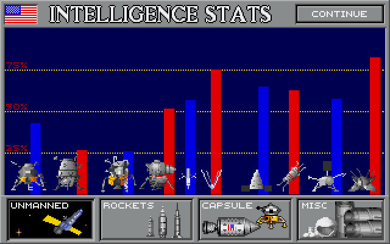
 
**Unmanned (Satellites & Probes)**
<table>
  <tr>
<td>
Cricket*</td><td>LK*</td><td>Eagle*</td><td>LKM*</td><td>Explorer</td><td>Sputnik</td><td>Ranger</td><td>Cosmos</td><td>Surveyor</td><td>Luna
  </tr>
</table>
* from Capsule

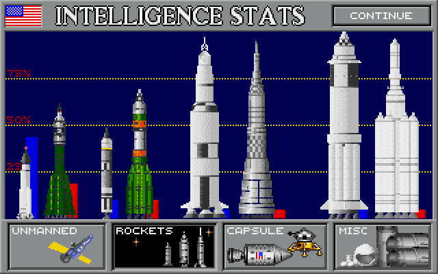
 
**Rockets**
<table>
  <tr>
    <td>
Atlas</td><td>R-7</td><td>Titan</td><td>Proton</td><td>Saturn</td><td>N1</td><td>Nova</td><td>UR-700</td>
  </tr>
</table>

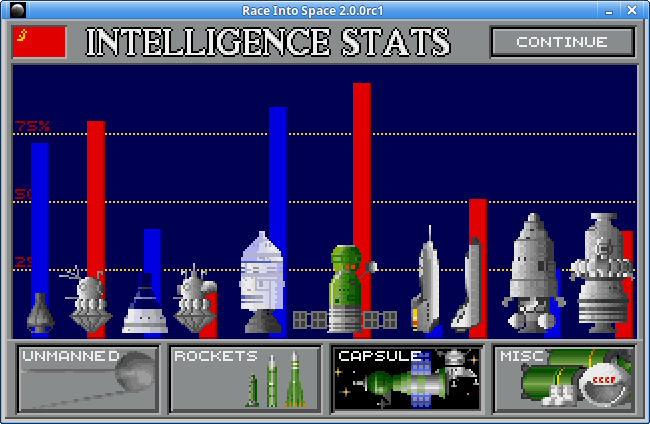
 
**Capsule (and Minishuttle)**
<table>
  <tr>
    <td>
Mercury</td><td>Vostok</td><td>Gemini</td><td>Voskhod</td><td>Apollo</td><td>Soyuz</td><td>XMS-2</td><td>Lapot</td><td>Jupiter</td><td>LK-700</td>
  </tr>
</table>

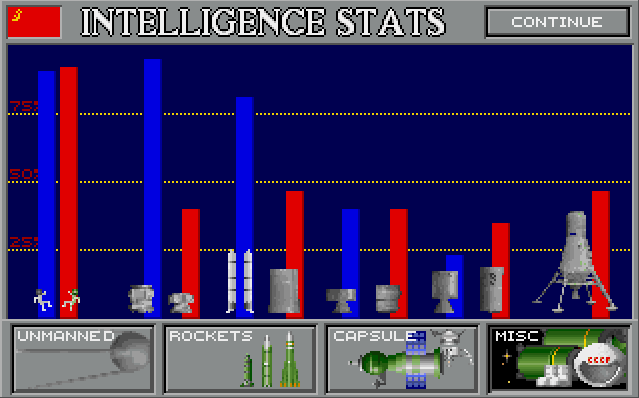
 
**Miscellaneous**
<table>
  <tr>
    <td>
US EVA suit</td><td>Soviet EVA suit</td><td>US Docking Module</td><td>Soviet Docking Module</td><td>US Strap-on Booster*</td><td>Soviet Booster Stage*</td><td>US Kicker-A</td><td>Soviet Kicker-A</td><td>US Kicker-B</td><td>Soviet Kicker-B</td><td>Soviet Kicker-C</td>
  </tr>
</table>
* from Rockets

## APPENDIX C

### Quick Reference

**Mission Abbreviations**

<table>
  <tr>
    <td>D</td>
    <td>Docking</td>
    <td>E</td>
    <td>EVA</td>
    <td>L</td>
    <td>LM Test</td>
    <td>JT</td>
    <td>Joint</td>
  </tr>
  <tr>
    <td>O</td>
    <td>Docking (Orbit)</td>
    <td>X</td>
    <td>Duration</td>
    <td>U</td>
    <td>Unmanned</td>
    <td>2E</td>
    <td>2 EVAs</td>
  </tr>
</table>

**Minimum rocketry for common missions, Historical Model**

<table>
  <tr>
    <td>Spacecraft</td>
    <td>Orbital</td>
    <td>Docking Test</td>
    <td>LM Test</td>
  </tr>
  <tr>
    <td>Gemini</td>
    <td>B/Atlas</td>
    <td>B/Titan</td>
    <td>Saturn</td>
  </tr>
  <tr>
    <td>Apollo</td>
    <td>B/Titan</td>
    <td>B/Titan</td>
    <td>Saturn</td>
  </tr>
  <tr>
    <td>XMS-2</td>
    <td>B/Titan</td>
    <td>B/Titan</td>
    <td>Saturn</td>
  </tr>
  <tr>
    <td>Voskhod</td>
    <td>B/R-7</td>
    <td>B/R-7</td>
    <td>N1</td>
  </tr>
  <tr>
    <td>Soyuz</td>
    <td>B/R-7</td>
    <td>B/Proton</td>
    <td>N1</td>
  </tr>
  <tr>
    <td>Lapot</td>
    <td>B/R-7</td>
    <td>B/Proton</td>
    <td>N1</td>
  </tr>
</table>

NOTE: The above is for Single missions; Joint missions can often use smaller rockets.

### **LIFT CAPABILITIES AND PAYLOAD WEIGHTS**

**US HARDWARE** (Historical Model)

<table>
  <tr>
    <td>Atlas</td>
    <td>500</td>
    <td></td>
    <td></td>
    <td></td>
    <td></td>
    <td>Eagle</td>
    <td>1500</td>
  </tr>
  <tr>
    <td>  boosted</td>
    <td>1300</td>
    <td></td>
    <td>Mercury</td>
    <td>500</td>
    <td></td>
    <td>Cricket</td>
    <td>1100</td>
  </tr>
  <tr>
    <td>Titan</td>
    <td>1200</td>
    <td></td>
    <td>Gemini</td>
    <td>1200</td>
    <td></td>
    <td></td>
    <td></td>
  </tr>
  <tr>
    <td>  boosted</td>
    <td>2000</td>
    <td></td>
    <td>Apollo</td>
    <td>1700</td>
    <td></td>
    <td>Kicker-A</td>
    <td>300</td>
  </tr>
  <tr>
    <td>Saturn</td>
    <td>3500</td>
    <td></td>
    <td>XMS-2</td>
    <td>1400</td>
    <td></td>
    <td>Kicker-B</td>
    <td>700</td>
  </tr>
  <tr>
    <td>  boosted</td>
    <td>4300</td>
    <td></td>
    <td>Jupiter</td>
    <td>4600</td>
    <td></td>
    <td></td>
    <td></td>
  </tr>
  <tr>
    <td>Nova</td>
    <td>4800</td>
    <td></td>
    <td></td>
    <td></td>
    <td></td>
    <td>DM</td>
    <td>300</td>
  </tr>
</table>

**SOVIET HARDWARE** (Historical Model)

<table>
  <tr>
    <td>R-7</td>
    <td>800</td>
    <td></td>
    <td></td>
    <td></td>
    <td></td>
    <td>LKM</td>
    <td>1700</td>
  </tr>
  <tr>
    <td>  boosted</td>
    <td>2000</td>
    <td></td>
    <td>Vostok</td>
    <td>700</td>
    <td></td>
    <td>LK</td>
    <td>1500</td>
  </tr>
  <tr>
    <td>Proton</td>
    <td>1900</td>
    <td></td>
    <td>Voskhod</td>
    <td>1400</td>
    <td></td>
    <td></td>
    <td></td>
  </tr>
  <tr>
    <td>  boosted</td>
    <td>3100</td>
    <td></td>
    <td>Soyuz</td>
    <td>1900</td>
    <td></td>
    <td>Kicker-A</td>
    <td>500</td>
  </tr>
  <tr>
    <td>N1</td>
    <td>3900</td>
    <td></td>
    <td>Lapot</td>
    <td>1800</td>
    <td></td>
    <td>Kicker-B</td>
    <td>700</td>
  </tr>
  <tr>
    <td>  boosted</td>
    <td>5100</td>
    <td></td>
    <td>LK-700</td>
    <td>5300</td>
    <td></td>
    <td>Kicker-C</td>
    <td>3000</td>
  </tr>
  <tr>
    <td>UR-700</td>
    <td>5500</td>
    <td></td>
    <td></td>
    <td></td>
    <td></td>
    <td>DM</td>
    <td>300</td>
  </tr>
</table>

**US & SOVIET HARDWARE** (Basic Model)

<table>
  <tr>
    <td>Atlas/R-7</td>
    <td>600</td>
    <td></td>
    <td></td>
    <td></td>
    <td></td>
    <td>Eagle/LKM</td>
    <td>1500</td>
  </tr>
  <tr>
    <td>  boosted</td>
    <td>1600</td>
    <td></td>
    <td>Mercury/Vostok</td>
    <td>500</td>
    <td></td>
    <td>Cricket/LK</td>
    <td>1000</td>
  </tr>
  <tr>
    <td>Titan/Proton</td>
    <td>1500</td>
    <td></td>
    <td>Gemini/Voskhod</td>
    <td>1200</td>
    <td></td>
    <td></td>
    <td></td>
  </tr>
  <tr>
    <td>  boosted</td>
    <td>2500</td>
    <td></td>
    <td>Apollo/Soyuz</td>
    <td>1600</td>
    <td></td>
    <td>Kicker-A</td>
    <td>300</td>
  </tr>
  <tr>
    <td>Saturn/N1</td>
    <td>3200</td>
    <td></td>
    <td>XMS-2/Lapot</td>
    <td>1500</td>
    <td></td>
    <td>Kicker-B</td>
    <td>600</td>
  </tr>
  <tr>
    <td>  boosted</td>
    <td>4200</td>
    <td></td>
    <td>Jupiter/LK-700</td>
    <td>4300</td>
    <td></td>
    <td>Kicker-C</td>
    <td>2500</td>
  </tr>
  <tr>
    <td>Nova/UR-700</td>
    <td>4800</td>
    <td></td>
    <td></td>
    <td></td>
    <td></td>
    <td>DM</td>
    <td>300</td>
  </tr>
</table>

**Peripheral Hardware Required for various approaches to the Moon landing**

<table>
  <tr>
    <td>Spacecraft</td>
    <td>Boosters</td>
    <td>Kicker-A/B</td>
    <td>Kicker-C</td>
    <td>LM</td>
    <td>DM</td>
  </tr>
  <tr>
    <td>Gemini/Voskhod</td>
    <td>Probably</td>
    <td>Yes</td>
    <td>No</td>
    <td>Cricket/LK</td>
    <td>Yes</td>
  </tr>
  <tr>
    <td>Apollo/Soyuz*</td>
    <td>Probably</td>
    <td>(LOR only)</td>
    <td>No</td>
    <td>Any</td>
    <td>Yes</td>
  </tr>
  <tr>
    <td>Soyuz Lunar Landing</td>
    <td>Usually</td>
    <td>No</td>
    <td>Yes</td>
    <td>No</td>
    <td>Yes</td>
  </tr>
  <tr>
    <td>XMS-2/Lapot</td>
    <td>Probably</td>
    <td>Yes</td>
    <td>No</td>
    <td>Any</td>
    <td>Yes</td>
  </tr>
  <tr>
    <td>Jupiter/LK-700</td>
    <td>No</td>
    <td>No</td>
    <td>No</td>
    <td>No</td>
    <td>No</td>
  </tr>
</table>
  * Except Soyuz Lunar Landing

**Hardware and R&D Costs**

**Basic Model**

<table>
  <tr>
    <td>Program</td>
    <td>Cost</td>
    <td>Unit</td>
    <td>R&D</td>
    <td>Weight</td>
    <td>Payload Lift</td>
    <td>Max R&D</td>
    <td>Max Safety</td>
  </tr>
  <tr>
    <td>Explorer/Sputnik</td>
    <td>6/6</td>
    <td>1/1</td>
    <td>1/1</td>
    <td>300/300</td>
    <td>--/--</td>
    <td>95%/95%</td>
    <td>98%/98%</td>
  </tr>
  <tr>
    <td>Ranger/Cosmos</td>
    <td>24/24</td>
    <td>4/4</td>
    <td>3/3</td>
    <td>700/700</td>
    <td>--/--</td>
    <td>90%/90%</td>
    <td>93%/93%</td>
  </tr>
  <tr>
    <td>Surveyor/Luna</td>
    <td>30/30</td>
    <td>6/6</td>
    <td>4/4</td>
    <td>1200/1200</td>
    <td>--/--</td>
    <td>85%/85%</td>
    <td>88%/88%</td>
  </tr>
  <tr>
    <td>Atlas/R-7</td>
    <td>24/24</td>
    <td>3/3</td>
    <td>2/2</td>
    <td>--/--</td>
    <td>600/600</td>
    <td>84%/84%</td>
    <td>98%/98%</td>
  </tr>
  <tr>
    <td>Titan/Proton</td>
    <td>60/60</td>
    <td>12/12</td>
    <td>4/4</td>
    <td>--/--</td>
    <td>1500/1500</td>
    <td>90%/90%</td>
    <td>98%/98%</td>
  </tr>
  <tr>
    <td>Saturn/N1</td>
    <td>84/84</td>
    <td>18/18</td>
    <td>6/6</td>
    <td>--/--</td>
    <td>3200/3200</td>
    <td>95%/95%</td>
    <td>98%/98%</td>
  </tr>
  <tr>
    <td>Nova/UR-700</td>
    <td>150/150</td>
    <td>30/30</td>
    <td>8/8</td>
    <td>--/--</td>
    <td>4800/4800</td>
    <td>95%/95%</td>
    <td>98%/98%</td>
  </tr>
  <tr>
    <td>B. Strap-On / B. Stage</td>
    <td>12/12</td>
    <td>3/3</td>
    <td>2/2</td>
    <td>--/--</td>
    <td>1000/1000</td>
    <td>85%/85%</td>
    <td>98%/98%</td>
  </tr>
  <tr>
    <td>Mercury/Vostok</td>
    <td>18/18</td>
    <td>2/2</td>
    <td>1/1</td>
    <td>500/500</td>
    <td>--/--</td>
    <td>76%/76%</td>
    <td>90%/90%</td>
  </tr>
  <tr>
    <td>Gemini/Voskhod</td>
    <td>24/24</td>
    <td>6/6</td>
    <td>2/2</td>
    <td>1200/1200</td>
    <td>--/--</td>
    <td>81%/81%</td>
    <td>94%/94%</td>
  </tr>
  <tr>
    <td>Apollo/Soyuz</td>
    <td>36/36</td>
    <td>12/12</td>
    <td>5/5</td>
    <td>1600/1600</td>
    <td>--/--</td>
    <td>87%/87%</td>
    <td>94%/94%</td>
  </tr>
  <tr>
    <td>XMS-2/Lapot</td>
    <td>60/60</td>
    <td>30/30</td>
    <td>7/7</td>
    <td>1500/1500</td>
    <td>--/--</td>
    <td>91%/91%</td>
    <td>94%/94%</td>
  </tr>
  <tr>
    <td>Jupiter/LK-700</td>
    <td>60/60</td>
    <td>30/30</td>
    <td>8/8</td>
    <td>4300/4300</td>
    <td>--/--</td>
    <td>89%/89%</td>
    <td>94%/94%</td>
  </tr>
  <tr>
    <td>Eagle/LKM</td>
    <td>30/30</td>
    <td>8/8</td>
    <td>2/2</td>
    <td>1500/1500</td>
    <td>--/--</td>
    <td>90%/90%</td>
    <td>94%/94%</td>
  </tr>
  <tr>
    <td>Cricket/LK</td>
    <td>42/42</td>
    <td>8/8</td>
    <td>4/4</td>
    <td>1000/1000</td>
    <td>--/--</td>
    <td>90%/90%</td>
    <td>94%/94%</td>
  </tr>
  <tr>
    <td>US Kicker-A / Sov Kicker-A</td>
    <td>12/12</td>
    <td>3/3</td>
    <td>1/1</td>
    <td>300/300</td>
    <td>--/--</td>
    <td>94%/94%</td>
    <td>97%/97%</td>
  </tr>
  <tr>
    <td>US Kicker-B / Sov Kicker-B</td>
    <td>18/18</td>
    <td>6/6</td>
    <td>2/2</td>
    <td>600/600</td>
    <td>--/--</td>
    <td>94%/94%</td>
    <td>96%/96%</td>
  </tr>
  <tr>
    <td>Sov Kicker-C</td>
    <td>40</td>
    <td>20</td>
    <td>4</td>
    <td>2500</td>
    <td>n/a</td>
    <td>90%</td>
    <td>95%</td>
  </tr>
  <tr>
    <td>US EVA Suit / Sov EVA Suit</td>
    <td>18/18</td>
    <td>--/--</td>
    <td>1/1</td>
    <td>--/--</td>
    <td>--/--</td>
    <td>91%/91%</td>
    <td>94%/94%</td>
  </tr>
  <tr>
    <td>US DM / Sov DM</td>
    <td>18/18</td>
    <td>2/2</td>
    <td>--/--</td>
    <td>300/300</td>
    <td>--/--</td>
    <td>--/--</td>
    <td>93%/93%</td>
  </tr>
</table>

**Historical Model**

<table>
  <tr>
    <td>Program</td>
    <td>Cost</td>
    <td>Unit</td>
    <td>R&D</td>
    <td>Weight</td>
    <td>Payload Lift</td>
    <td>Max R&D</td>
    <td>Max Safety</td>
  </tr>
  <tr>
    <td>Explorer/Sputnik</td>
    <td>6/6</td>
    <td>1/1</td>
    <td>1/1</td>
    <td>200/400</td>
    <td>--/--</td>
    <td>95%/95%</td>
    <td>98%/98%</td>
  </tr>
  <tr>
    <td>Ranger/Cosmos</td>
    <td>24/20</td>
    <td>5/3</td>
    <td>3/3</td>
    <td>700/1000</td>
    <td>--/--</td>
    <td>90%/88%</td>
    <td>93%/93%</td>
  </tr>
  <tr>
    <td>Surveyor/Luna</td>
    <td>30/26</td>
    <td>7/6</td>
    <td>4/4</td>
    <td>1200/1500</td>
    <td>--/--</td>
    <td>85%/85%</td>
    <td>88%/88%</td>
  </tr>
  <tr>
    <td>Atlas/R-7</td>
    <td>26/20</td>
    <td>3/3</td>
    <td>2/2</td>
    <td>--/--</td>
    <td>500/800</td>
    <td>87%/85%</td>
    <td>98%/98%</td>
  </tr>
  <tr>
    <td>Titan/Proton</td>
    <td>60/60</td>
    <td>12/12</td>
    <td>4/4</td>
    <td>--/--</td>
    <td>1200/1900</td>
    <td>91%/90%</td>
    <td>98%/98%</td>
  </tr>
  <tr>
    <td>Saturn/N1</td>
    <td>90/84</td>
    <td>18/18</td>
    <td>6/7</td>
    <td>--/--</td>
    <td>3500/3900</td>
    <td>95%/93%</td>
    <td>98%/98%</td>
  </tr>
  <tr>
    <td>Nova/UR-700</td>
    <td>150/150</td>
    <td>30/30</td>
    <td>8/8</td>
    <td>--/--</td>
    <td>4800/5500</td>
    <td>94%/94%</td>
    <td>98%/98%</td>
  </tr>
  <tr>
    <td>B. Strap-On / B. Stage</td>
    <td>18/15</td>
    <td>4/4</td>
    <td>2/2</td>
    <td>--/--</td>
    <td>800/1200</td>
    <td>85%/87%</td>
    <td>98%/98%</td>
  </tr>
  <tr>
    <td>Mercury/Vostok</td>
    <td>20/18</td>
    <td>3/3</td>
    <td>1/1</td>
    <td>500/700</td>
    <td>--/--</td>
    <td>78%/76%</td>
    <td>92%/92%</td>
  </tr>
  <tr>
    <td>Gemini/Voskhod</td>
    <td>30/24</td>
    <td>7/6</td>
    <td>2/2</td>
    <td>1200/1400</td>
    <td>--/--</td>
    <td>83%/80%</td>
    <td>94%/92%</td>
  </tr>
  <tr>
    <td>Apollo/Soyuz</td>
    <td>40/36</td>
    <td>14/12</td>
    <td>5/5</td>
    <td>1700/1900</td>
    <td>--/--</td>
    <td>89%/85%</td>
    <td>94%/94%</td>
  </tr>
  <tr>
    <td>XMS-2/Lapot</td>
    <td>55/65</td>
    <td>30/30</td>
    <td>7/7</td>
    <td>1400/1800</td>
    <td>--/--</td>
    <td>91%/87%</td>
    <td>94%/94%</td>
  </tr>
  <tr>
    <td>Jupiter/LK-700</td>
    <td>65/60</td>
    <td>30/30</td>
    <td>8/9</td>
    <td>4600/5300</td>
    <td>--/--</td>
    <td>89%/89%</td>
    <td>94%/94%</td>
  </tr>
  <tr>
    <td>Eagle/LKM</td>
    <td>30/35</td>
    <td>8/8</td>
    <td>2/2</td>
    <td>1500/1700</td>
    <td>--/--</td>
    <td>90%/91%</td>
    <td>94%/94%</td>
  </tr>
  <tr>
    <td>Cricket/LK</td>
    <td>42/48</td>
    <td>9/9</td>
    <td>4/4</td>
    <td>1100/1500</td>
    <td>--/--</td>
    <td>89%/90%</td>
    <td>94%/93%</td>
  </tr>
  <tr>
    <td>US Kicker-A / Sov Kicker-A</td>
    <td>12/12</td>
    <td>3/3</td>
    <td>1/1</td>
    <td>300/500</td>
    <td>--/--</td>
    <td>92%/91%</td>
    <td>97%/95%</td>
  </tr>
  <tr>
    <td>US Kicker-B / Sov Kicker-B</td>
    <td>18/18</td>
    <td>6/6</td>
    <td>2/2</td>
    <td>700/700</td>
    <td>--/--</td>
    <td>94%/91%</td>
    <td>97%/95%</td>
  </tr>
  <tr>
    <td>Sov Kicker-C</td>
    <td>40</td>
    <td>20</td>
    <td>4</td>
    <td>3000</td>
    <td>n/a</td>
    <td>90%</td>
    <td>94%</td>
  </tr>
  <tr>
    <td>US EVA Suit / Sov EVA Suit</td>
    <td>18/18</td>
    <td>--/--</td>
    <td>1/1</td>
    <td>--/--</td>
    <td>--/--</td>
    <td>91%/91%</td>
    <td>94%/94%</td>
  </tr>
  <tr>
    <td>US DM / Sov DM</td>
    <td>18/15</td>
    <td>3/2</td>
    <td>--/--</td>
    <td>300/300</td>
    <td>--/--</td>
    <td>--/--</td>
    <td>93%/94%</td>
  </tr>
</table>

